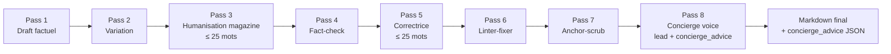

# Concierge voice pipeline — MyConciergeHotel.com

ConciergeTravel.fr a été rebrandé en **MyConciergeHotel.com** avec une nouvelle voix éditoriale — « Le Concierge ». ADR-0011 acte trois arbitrages structurants : FAQ riche conservée + bloc visible plus court, phrases ≤ 25 mots strict, posture concierge complice + rigueur factuelle de fact-checker. Cette skill capitalise le pipeline construit pour appliquer ces règles sans casser les leviers SEO/GEO existants.

## Triggers

Invoquer dès que :

- On génère du contenu éditorial pour un hôtel, un guide, un ranking ou un long-read.
- On ajoute un nouveau type d'entité éditoriale qui doit porter un « Conseil du Concierge ».
- On débogue un audit `concierge_advice` (envelope 50-110 mots) ou un linter `sentence_length`.
- On modifie le prompt système d'un pipeline LLM existant (`generate-guide-v2`, `generate-ranking-v2`, `pipeline.ts` pass 8, `translate-hotels-en`).
- On veut shortener du contenu legacy publié avant l'arbitrage ADR-0011.

## Décisions structurantes (ADR-0011)

| #      | Conflit                                                      | Décision                                                                                                                             | Référence                                                                                                 |
| ------ | ------------------------------------------------------------ | ------------------------------------------------------------------------------------------------------------------------------------ | --------------------------------------------------------------------------------------------------------- |
| **C1** | FAQ visible 5 vs JSON-LD 10-15                               | **JSON-LD garde 10-15** ; le bloc visible devient **Top 5 du Concierge**, sous-ensemble exact des 5 du JSON-LD                       | [ADR-0011](../../docs/adr/0011-concierge-voice.md)                                                        |
| **C2** | Phrases ≤ 25 mots vs ≥ 15 % phrases longues (style-guide §9) | **≤ 25 mots strict**, métrique long-sentence désactivée                                                                              | [ADR-0011](../../docs/adr/0011-concierge-voice.md), [style-guide §9](../../docs/editorial/style-guide.md) |
| **C3** | Pas un journaliste vs rigueur journalistique                 | **Posture Concierge complice + rigueur factuelle de fact-checker** (chiffres précis, sources Atout France/Michelin/Wikidata nommées) | [ADR-0011](../../docs/adr/0011-concierge-voice.md)                                                        |

## Architecture du pipeline (Phase 1 → Phase 8)



Pass 8 est le **point unique** où la voix Concierge prend la main : il réécrit le lead en 200 mots strict (toutes phrases ≤ 25 mots), et produit le bloc `concierge_advice` bilingue (FR + EN, 50-110 mots, `tip_for` parmi `room | dining | timing | access | service | wellness`).

Prompts amendés en Phase 2 pour propager la règle ≤ 25 mots dès les passes intermédiaires :

- [`prompts/03-humanisation-magazine.md`](../../scripts/editorial-pilot/prompts/03-humanisation-magazine.md) — section « Contrainte universelle » en tête.
- [`prompts/05-correctrice-post-fact-check.md`](../../scripts/editorial-pilot/prompts/05-correctrice-post-fact-check.md) — idem.
- [`prompts/08-concierge-voice.md`](../../scripts/editorial-pilot/prompts/08-concierge-voice.md) — le prompt clé qui produit le bloc Concierge.
- Prompts inline dans [`generate-guide-v2.ts`](../../scripts/editorial-pilot/src/guides/generate-guide-v2.ts) et [`generate-ranking-v2.ts`](../../scripts/editorial-pilot/src/rankings/generate-ranking-v2.ts).

## Rule 1 — Bloc ConciergeAdvice fiche hôtel (CDC §2)

Le bloc visible vit dans [`apps/web/src/components/hotel/concierge-advice.tsx`](../../apps/web/src/components/hotel/concierge-advice.tsx) — Server Component, sobre, étoile en marge, fond légèrement teinté. Position : **juste avant `<HotelFaq>`** dans [`apps/web/src/app/[locale]/hotel/[slug]/page.tsx`](../../apps/web/src/app/[locale]/hotel/[slug]/page.tsx). C'est le 8ᵉ des 8 blocs CDC §2 (« Conseil du Concierge »).

Le data flow :

```
Payload `hotels.concierge_advice` (JSONB)
  ↓ validateConciergeAdvice (50-110 mots, tip_for enum)
public.hotels.concierge_advice
  ↓ ConciergeAdviceSchema (Zod, get-hotel-by-slug.ts)
readConciergeAdvice(advice, locale, fallback='fr')
  ↓
<ConciergeAdvice locale advice />
```

**Hard rules** propagées dans [`.cursor/rules/hotel-detail-page.mdc`](../../.cursor/rules/hotel-detail-page.mdc) :

- `concierge_advice.fr.body` 50-110 mots (envelope élargie après audit Phase 3, médiane visée 70 mots).
- `concierge_advice.en.body` même contrainte ; EN-GB légèrement plus formel mais ton complice conservé.
- Bloc rendu inconditionnellement si données présentes ; on **ne renvoie pas `null` silencieusement** : Payload bloque la publication via `beforeValidate` hook si `is_published: true` sans `concierge_advice`.

## Rule 2 — Humanizer-only script (vague 1 corpus)

Pour les hôtels déjà enrichis (passes 1-7 jouées avant ADR-0011), on évite la full-regen via [`scripts/editorial-pilot/src/concierge/run-humanizer.ts`](../../scripts/editorial-pilot/src/concierge/run-humanizer.ts) :

```bash
# corpus entier (~150 hôtels, ~3-5h)
pnpm --filter @mch/editorial-pilot exec tsx src/concierge/run-humanizer.ts --all --concurrency 4

# seulement ceux sans concierge_advice
pnpm --filter @mch/editorial-pilot exec tsx src/concierge/run-humanizer.ts --missing --concurrency 4

# ceux dont l'advice est hors envelope 50-110 mots
pnpm --filter @mch/editorial-pilot exec tsx src/concierge/run-humanizer.ts --invalid --concurrency 4

# un hôtel précis
pnpm --filter @mch/editorial-pilot exec tsx src/concierge/run-humanizer.ts --slug le-bristol-paris
```

Ce script **ne rejoue pas** les passes 1-7 : il reconstruit un brief synthétique depuis Supabase (`description_fr`, `long_description_sections`, `signature_experiences`, `restaurant_info`, `spa_info`, `amenities`) et appelle Pass 8 uniquement. Output validé par `ConciergePass8OutputSchema` puis upserté.

Pattern type :

- Concurrence 4 = sweet spot OpenAI rate limit + Supabase pooler.
- Mode `--dry-run` pour preview JSON sans écriture.
- `--no-en` pour économiser le call EN quand on régénère uniquement FR.

### Rule 2 bis — `translate-guides-en.ts` est un gap connu

Les guides éditoriaux (40 publiés au 19/05/2026) ont un **EN ratio de
4-5 %** côté `sections[].body_en` (vs `body_fr` 2200-4500 chars). C'est
intentionnel côté pipeline : [`generate-guide-v2.ts`](../../scripts/editorial-pilot/src/guides/generate-guide-v2.ts) ligne 762 déclare
explicitement `body_en` optionnel, court (10-30 mots), avec un commentaire
« the I18N pipeline will fill it » — mais **cette I18N pipeline guides
n'existe pas encore**. Seul `translate-hotels-en.ts` existe (Rule 2).

Conséquences :

- Les 40 guides ont leur `alternates.languages` EN mais le contenu réel est
  ~5 % du FR. Acceptable en V1 (40 pages FR-only équivalent), bloquant pour
  V2 (de/es/it nécessite EN propre comme pivot).
- À implémenter sur le pattern de `translate-hotels-en.ts` :
- Schema Zod (`sections[]`, `faq[]`, `summary`, `meta_title`, `meta_desc`,
  `tables[]`, `glossary[]`, `editorial_callouts[]`).
- `mergeEn*` helpers : ne JAMAIS écrabouiller un champ FR populé par une
  traduction vide ou très courte.
- Coût empirique attendu : ~$0.30-0.50 par guide (vs $0.30 pour
  `translate-hotels-en.ts` qui traite ~10 KB de FR).
- Audit dispo : [`scripts/editorial-pilot/inspect-published-guides-en.mjs`](../../scripts/editorial-pilot/inspect-published-guides-en.mjs)
  ratio EN / FR par guide.

Anti-pattern à refuser : publier de nouveaux guides en V2 sans avoir
construit `translate-guides-en.ts`. Capitalisation à compléter dès
qu'on attaque le rollout multilingue.

## Rule 3 — Sentence-length shortener (vague 2bis guides + rankings)

Les ~30 guides + ~100 rankings publiés avant Phase 2 ont entre 35 % et 39 % de phrases > 25 mots. Full-regen 8-pass coûterait 50-80 €. À la place, [`scripts/editorial-pilot/src/concierge/run-shorten-sections.ts`](../../scripts/editorial-pilot/src/concierge/run-shorten-sections.ts) cible **uniquement** les phrases longues :

```bash
# top 25 guides les plus en faute, concurrency 4
pnpm --filter @mch/editorial-pilot exec tsx src/concierge/run-shorten-sections.ts --table guides --worst 25 --concurrency 4

# top 60 rankings les plus en faute
pnpm --filter @mch/editorial-pilot exec tsx src/concierge/run-shorten-sections.ts --table rankings --worst 60 --concurrency 4

# un seul guide
pnpm --filter @mch/editorial-pilot exec tsx src/concierge/run-shorten-sections.ts --table guides --slug bourgogne
```

Mécanique de sûreté :

1. Identifie les chunks (`summary_fr`, `sections[].body_fr`, `intro_fr`, `outro_fr`) qui contiennent au moins une phrase > 25 mots.
2. Envoie chaque chunk concerné à gpt-4o-mini avec un prompt « réécris chaque phrase > 25 mots en 1-3 phrases courtes ≤ 25 mots, conserve chiffres / noms propres / sens ».
3. **Validation post-LLM** côté script :
   - Delta wordcount ≤ 15 % (rejette les rewrites qui ajoutent ou retirent trop).
   - Toutes phrases ≤ 30 mots (marge de tolérance vs 25 strict).
   - Tous les chiffres `\b\d[\d\s.,]*\b` du chunk original sont retrouvés dans le rewrite.
4. Si validation échoue → on conserve le chunk d'origine, statut `PARTIAL`. Si tous les chunks passent → `OK`. Aucun fallback silencieux.

Coût empirique : ~1500 input + 1000 output tokens par guide section, ~$0.01 par guide complet en gpt-4o-mini. Bien plus cheap que full-regen.

### Rule 3 bis — Shortener obligatoire sur les drafts fraîchement bulk-générés

Les prompts inline `generate-guide-v2.ts` + `generate-ranking-v2.ts` portent la
règle « toutes phrases ≤ 25 mots », mais en pratique gpt-4o-mini _ne respecte
pas la règle à 100 %_ sur un batch. Audit empirique 19/05/2026 sur 10 guides
fraîchement générés par `guides:bulk` Phase F (cf.
[`scripts/editorial-pilot/runs/guides-audit-2026-05-19T10-11-55.json`](../../scripts/editorial-pilot/runs/guides-audit-2026-05-19T10-11-55.json)) :

| Métrique                  | Drafts fraîches | Published bar (30 guides) |
| ------------------------- | --------------- | ------------------------- |
| Sentences > 25 mots (avg) | **40**          | 15                        |
| Sentences > 25 mots (max) | **49**          | 53                        |

Soit **2.7 × le bar publié** sans la passe shortener. Conclusion :

- Ne **jamais publier directement** la sortie de `rankings:bulk` /
  `guides:bulk` avant d'avoir passé `run-shorten-sections.ts --slugs <list>`
  sur le delta. Le shortener accepte un slug même non-publié (`--slugs`
  bypass le filtre `is_published = true` du `listSlugs`).
- Coût marginal : ~$0.30 pour 10 guides, 2.4 min wall-clock à
  `--concurrency 3`. Négligeable vs la régression SEO de phrases denses.
- Audit type pre-publish : [`scripts/editorial-pilot/audit-guides-drafts.mjs`](../../scripts/editorial-pilot/audit-guides-drafts.mjs)
  (similaire pour rankings via Rule 5).

Workflow canonique pour publier un batch de drafts :

```bash
# 1. Generate bulk
pnpm --filter @mch/editorial-pilot run guides --slug=sologne,pays-basque,...

# 2. Shorten (pre-publish gate)
pnpm --filter @mch/editorial-pilot exec tsx \
 src/concierge/run-shorten-sections.ts --table guides \
 --slugs sologne,pays-basque,... --concurrency 3

# 3. Audit
node scripts/editorial-pilot/audit-guides-drafts.mjs

# 4. Publish (ratchet UPDATE — never downgrades)
node scripts/editorial-pilot/publish-guide-drafts.mjs
```

## Rule 4 — Linter sentence_length (CI cheap)

[`scripts/editorial-pilot/src/linter.ts`](../../scripts/editorial-pilot/src/linter.ts) embarque désormais `lintSentenceLength` (catégorie `sentence_length`, severity `medium`). Il s'exécute automatiquement dans le wrapper `lintMarkdown` consommé par le pass 6 du pipeline. La règle :

- Ignore titres `#`, listes `-`, blockquotes `>`, tables `|`, blocs code triple-backtick.
- Sépare les phrases par `(?<=[.!?…])\s+`.
- Compte les mots via `countWords` (regex Unicode L|N).
- Toute phrase > 25 mots → violation `medium`, signalée au pass 6 linter-fixer qui peut la réécrire.

`severity: 'medium'` (pas `blocker`) parce que le content legacy doit pouvoir continuer à publier sans bloquer toute la pipeline ; les nouvelles générations passes 3/5/8 doivent rester à zéro violation.

## Rule 5 — Audit + verify scripts

Trois scripts à connaître pour mesurer l'avancement de la voix Concierge :

- **[`scripts/editorial-pilot/verify-content-stats.mjs`](../../scripts/editorial-pilot/verify-content-stats.mjs)** — snapshot global, inclut désormais section « Concierge advice (ADR-0011, envelope 50-110 mots) » : count FR/EN présents, count in-envelope, count missing.
- **[`scripts/editorial-pilot/verify-gaps.mjs`](../../scripts/editorial-pilot/verify-gaps.mjs)** — liste détaillée des hôtels publiés sans `concierge_advice` ou hors envelope (bloquant si on tente de publier).
- **[`scripts/editorial-pilot/check-sentence-length.mjs`](../../scripts/editorial-pilot/check-sentence-length.mjs)** — % de phrases > 25 mots par guide / ranking, top 10 worst.
- **[`scripts/editorial-pilot/audit-concierge.mjs`](../../scripts/editorial-pilot/audit-concierge.mjs)** — audit fin des body lengths + flags « Mon conseil/My tip » prefixes + sentences > 25 mots dans les advice eux-mêmes.

## Rule 6 — Family of short-text humanizers (POI / events / FAQ)

Phases 2-4 du sprint « Restructuration Concierge — POI, Services, FAQ, Événements » ont ajouté trois humanizers parallèles à `run-humanizer.ts` (le humanizer historique pour `concierge_advice`). Tous suivent la même mécanique pour réécrire les contenus **factuels courts** en voix Concierge sans toucher aux passes 1-7.

| Script                                                                                           | Cible                                                       | Batch   | Cap                         | Données touchées           |
| ------------------------------------------------------------------------------------------------ | ----------------------------------------------------------- | ------- | --------------------------- | -------------------------- |
| [`run-humanizer.ts`](../../scripts/editorial-pilot/src/concierge/run-humanizer.ts)               | `hotels.concierge_advice` (advice 50-110 mots, FR+EN)       | 1/call  | 1/hôtel                     | `concierge_advice` JSONB   |
| [`run-humanizer-pois.ts`](../../scripts/editorial-pilot/src/concierge/run-humanizer-pois.ts)     | `points_of_interest[].description_fr` + `bucket_tip_fr`     | 10/call | 8 visit / 6 do / 8 shop     | `points_of_interest` JSONB |
| [`run-humanizer-events.ts`](../../scripts/editorial-pilot/src/concierge/run-humanizer-events.ts) | `upcoming_events[].description_fr` (30-50 mots)             | 5/call  | 5/hôtel                     | `upcoming_events` JSONB    |
| [`run-humanizer-faq.ts`](../../scripts/editorial-pilot/src/concierge/run-humanizer-faq.ts)       | `faq_content[].answer_fr` + `featured` + `concierge_tip_fr` | 4/call  | 5 featured + ≤ 2 tips/hôtel | `faq_content` JSONB        |

### Convention de batching par sortie LLM

- **Batch size = nombre d'items qu'un seul `gpt-4o-mini` génère proprement dans le budget JSON 3500 tokens output.** Empirique : 1 advice (200 mots), 10 POI descriptions (1 phrase chacune), 5 events (40 mots chacun), 4 FAQ (50-80 mots chacune).
- Au-delà, on observe des troncatures JSON ou des réponses incomplètes (items manquants dans le retour). Le harness ne fait pas de continuation — un item omis = un retry.
- **Concurrency 5** est le plafond Supabase pooler + OpenAI rate limit pour un run sur les 106 hôtels (Tier 1 OpenAI = 500 RPM, ≈ 8 RPS, marge confortable).

### Retry harness (rule clé — Phase 4)

`run-humanizer-faq.ts` introduit un harness de retry par batch (à généraliser aux autres humanizers quand ils touchent à des règles dures comme ≤ 25 mots) :

1. Premier appel : `temperature = 0.6`.
2. Validation Zod + `lintConciergeSummary` par item. Les items rejetés (blocker) sont mémorisés (`match_key`).
3. Retry 1 (`temperature = 0.85`) **uniquement sur les match_keys rejetés**, avec un `REMINDER` injecté dans le user prompt qui rappelle :
   - Tentative N/3.
   - Les phrases précédentes étaient > 25 mots ou contenaient un mot banni.
   - Cible : 2-4 phrases courtes ≤ 25 mots, présent, voix active.
   - Total mots-cible.
   - Liste des `match_keys` à corriger (max 8 pour rester sous la limite tokens).
4. Retry 2 (`temperature = 0.95`), mêmes règles.
5. Au bout de 3 tentatives, les items restants comptent en `rejected` (legacy answer préservé en DB).

Empirique : 12-14 hôtels qui échouaient avec un seul call passent à zéro échec avec le harness 3-tentatives. Coût marginal : +25 % tokens sur les batchs en faute (les batchs propres sortent au 1er essai).

### `--invalid` vs `--all` — préserver la curation

Quand un humanizer accepte un flag `--invalid` (rerun uniquement sur les items qui échouent le linter), le merge **ne doit pas écraser** les champs curés (`featured`, `concierge_tip_fr`, etc.) des items qu'il n'a pas réécrits. `run-humanizer-faq.ts#mergeRewrites(original, rewrites, isPartialRewrite)` capitalise ce pattern :

- Mode `isPartialRewrite = true` (`--invalid` ou `--missing`) :
  - Préserve les `featured: true` existants sur les items non réécrits.
  - Backfill featured uniquement à partir des items réécrits, jusqu'à 5.
  - Préserve les `concierge_tip_fr` existants.
- Mode `isPartialRewrite = false` (`--all`, `--slug`) :
  - Le LLM voit le hôtel complet → curation `featured` exclusive sur ses réponses (cap 5).
  - Drop des `concierge_tip_fr` legacy non confirmés par le LLM.

Sans ce switch, un `--invalid` qui réécrit 3 items sur 13 perd les 5 featured existants et n'en remarque que 0-3 dans le run partiel.

### Audit scripts associés

| Script                                                                                   | Mesure                                                                                 |
| ---------------------------------------------------------------------------------------- | -------------------------------------------------------------------------------------- |
| [`audit-concierge-pois.mjs`](../../scripts/editorial-pilot/audit-concierge-pois.mjs)     | Couverture FR + Concierge tips par bucket, sentence-length, banned phrases             |
| [`audit-concierge-events.mjs`](../../scripts/editorial-pilot/audit-concierge-events.mjs) | Couverture FR + breakdown par catégorie d'événement                                    |
| [`audit-concierge-faq.mjs`](../../scripts/editorial-pilot/audit-concierge-faq.mjs)       | Couverture FR + count featured (target = 5) + tips + sentence-length + banned phrases  |
| [`audit-concierge-fiche.mjs`](../../scripts/editorial-pilot/audit-concierge-fiche.mjs)   | **Cross-blocks** — score % par hôtel sur advice + POI + events + FAQ ; échec si < 95 % |

⚠️ **Word counter en lockstep avec le linter.** Les audits ont d'abord utilisé `split(/[^\p{L}\p{N}]+/u)` (cf. Rule 8 anti-pattern), ce qui sur-comptait les hyphens et apostrophes : « L'Auberge », « Saint-Tropez », « Centre-Val » étaient comptés 2 mots au lieu d'un. `linter.ts#countWords` splite sur `/\s+/` puis filtre `[\p{L}\p{N}]`. Les audits doivent partager cette implémentation — sinon le diagnostic dérive du gatekeeper et on signale des phrases « trop longues » qui passent en réalité le humanizer.

## Rule 7 — Payload publication blocker

[`apps/admin/src/collections/hotels.ts`](../../apps/admin/src/collections/hotels.ts) embarque un hook `beforeValidate` qui refuse de **basculer** `is_published` en `true` si `concierge_advice` est manquant ou hors envelope :

```ts
const becomingPublished = next['is_published'] === true && originalDoc?.is_published !== true;
if (!becomingPublished) return data;
// … check concierge_advice.fr.body 50-110 mots …
throw new Error('Publication bloquée (ADR-0011) : …');
```

Ne se déclenche que lors de la **transition** vers publié — un hôtel déjà publié peut continuer à être édité par batch sans déclencher le blocage. Permet aux scripts de cleanup (humanizer-only, shortener) de tourner sans entrave.

## Rule 8 — Tests E2E + linter intégré CI

- [`apps/web/e2e/concierge-voice.spec.ts`](../../apps/web/e2e/concierge-voice.spec.ts) — 4 specs :
  1. FR — bloc visible, eyebrow + titre + corps (anchors stables sur substrings « Mon conseil », « 305 »).
  2. EN — version anglaise, anchor « My tip ».
  3. axe scan scoped à `#concierge-advice` (zéro violation WCAG 2.2 AA).
  4. Position relative : `#concierge-advice` est au-dessus de la FAQ.
- Le synthetic hotel ([`apps/web/src/server/hotels/dev-fake-hotel-detail.ts`](../../apps/web/src/server/hotels/dev-fake-hotel-detail.ts)) ship un `concierge_advice` FR + EN dans l'envelope 50-110 mots, gated par `MCH_E2E_FAKE_HOTEL_ID`.

## Rule 9 — Le 8-pass pipeline n'écrit PAS en base, il faut pousser explicitement

Le naming `summary.json.pass_8_advice_persisted: true` est trompeur : il
signifie uniquement « Pass 8 a été validé et écrit sur disque dans
`output/<slug>/08-concierge-advice.json` ». **Aucune écriture Supabase**
n'a lieu pendant la pipeline.

Pour pousser le contenu généré vers la base, deux scripts complémentaires
existent côté `scripts/editorial-pilot/` :

1. [`push-pipeline-advice.mjs`](../../scripts/editorial-pilot/push-pipeline-advice.mjs) — push **uniquement** `concierge_advice` (JSONB). Utile pour relancer le pass 8 seul sur un hôtel déjà publié.
2. [`push-pilot-fiches.mjs`](../../scripts/editorial-pilot/push-pilot-fiches.mjs) — push **complet** : parse `08-concierge-voice.md`, dérive `long_description_sections` (un array d'objets `{anchor, title_fr, title_en, body_fr, body_en}`) et écrit en même temps `concierge_advice`. Skip explicite du bloc `## En pratique` (donnée structurée déjà en colonnes dédiées).

**Contrats à respecter dans tout nouveau pusher :**

```ts
// Ratchet `is_published` : ne JAMAIS flipper true → false.
// Update ciblé sur les seules colonnes éditoriales, pas les colonnes ARI/booking.
update public.hotels
   set long_description_sections = $2::jsonb,
       concierge_advice = $3::jsonb,
       updated_at = now()
 where slug = $1
```

Parsing markdown :

- Strip le `# <H1>` (titre hôtel) — il vit dans la colonne `name`.
- Lead paragraphes (avant le premier `##`) → section synthétique
  `{anchor:'presentation', title_fr:'Présentation', ...}`.
- Chaque `## Title` → un objet de la liste. Mapping des titres canoniques
  vers anchors stables (`Histoire & héritage` → `histoire`, etc.) dans le
  script. Les anchors stables sont **contractuels** côté frontend (TOC,
  scroll-spy, JSON-LD `Article.hasPart`).
- `## En pratique` skippé (info répliquée dans les colonnes `address`,
  `capacity`, `restaurant_info`, `policies`).

Vérification post-push (canonique) :

```sql
select slug,
       jsonb_array_length(long_description_sections) as sections,
       length(concierge_advice::text) as advice_len,
       concierge_advice->'fr'->>'tip_for' as tip_for,
       is_published
  from public.hotels
 where slug = $1;
```

Une fiche publiée saine après push :

- `sections >= 8` (présentation + 7 thématiques attendues)
- `advice_len` entre 700 et 1500 b
- `tip_for` ∈ `{room, dining, timing, access, service, wellness}`
- `is_published` inchangé (le push ne flippe rien)

**Anti-pattern fréquent** : laisser le 8-pass écrire le markdown sur
disque, valider visuellement la fiche `docs/editorial/pilots/<slug>.md`,
oublier le push. La fiche prod reste vide. Mettre **systématiquement** un
appel `push-pilot-fiches.mjs --slugs <list>` ou `--all` à la fin du run
pipeline (ou en step CI).

## Anti-patterns à refuser en revue

- Bloc `<ConciergeAdvice>` rendu en client component (`'use client'`) — Server Component obligatoire, pas de bundle JS additionnel.
- Régénérer un hôtel complet (passes 1-7) juste pour mettre à jour `concierge_advice` — utiliser `run-humanizer.ts`.
- Régénérer un guide complet (calls M + S + B + F + X) juste pour shorter les phrases — utiliser `run-shorten-sections.ts`.
- Ajouter un champ JSON-LD `Hotel.description` qui duplique le `concierge_advice.fr.body` — le body Concierge est volontairement narratif, le `description` reste le `factual_summary` (CDC §2.3).
- Désactiver le hook Payload `beforeValidate` pour publier une fiche sans advice — l'absence d'advice = absence de différenciation MyConciergeHotel.
- Tolérer une phrase > 30 mots dans un advice — la marge tolerance du shortener s'applique au corps legacy, pas au pass 8.
- Faire jouer Pass 8 sans `MCH_OPENAI_API_KEY` valide — pas de fallback Claude prévu (le ton Concierge est calibré sur GPT-4o-mini, modèle peu cher mais voix testée).
- **Compter les mots en SQL avec `regexp_split_to_array(text, '\s+')`** — c'est faux. Le code de prod (Zod `apps/web/src/server/hotels/get-hotel-by-slug.ts`, `run-humanizer.ts#countWordsLocal`, Payload `apps/admin/src/collections/hotels.ts`) splite sur `/[^\p{L}\p{N}]+/u`, donc toute ponctuation est un séparateur. SQL `\s+` ne split que sur l'espace ⇒ "Mon conseil :" compte pour 3 mots côté SQL et 2 côté runtime ⇒ phantoms outliers reportés par `verify-content-stats.mjs` alors que le humanizer `--invalid` dit "rien à faire". Les deux compteurs **doivent rester en lockstep**. La forme SQL portable correcte est `regexp_split_to_array(trim(text), '[^[:alnum:]]+')` (PostgreSQL POSIX). Bug détecté le 18 mai 2026, corrigé dans `verify-content-stats.mjs` + `verify-gaps.mjs`.

## References

- ADR : [`docs/adr/0011-concierge-voice.md`](../../docs/adr/0011-concierge-voice.md)
- Master plan : [`docs/editorial/baseline-2026-05.md`](../../docs/editorial/baseline-2026-05.md)
- Style guide : [`docs/editorial/style-guide.md`](../../docs/editorial/style-guide.md) §9 (sentence length amendée)
- Brand : [`EDITORIAL_VOICE.md`](../../EDITORIAL_VOICE.md) §6 (arbitrages C1/C2/C3)
- Skills liées :
  - [`llm-output-robustness/SKILL.md`](../llm-output-robustness/SKILL.md) — multi-call pipelines, Zod drift, retry strategy (cadre du pass 8).
  - [`editorial-long-read-rendering/SKILL.md`](../editorial-long-read-rendering/SKILL.md) — rendering pattern pour guides / rankings, callouts `concierge_tip`.
  - [`content-modeling/SKILL.md`](../content-modeling/SKILL.md) — Payload `concierge_advice` field shape + validation.
  - [`structured-data-schema-org/SKILL.md`](../structured-data-schema-org/SKILL.md) — FAQ JSON-LD 10-15 entries (préservé).
  - [`geo-llm-optimization/SKILL.md`](../geo-llm-optimization/SKILL.md) — AEO blocks 40-80 mots vs FAQ 50-100 mots (densité par cible).
  - [`seo-technical/SKILL.md`](../seo-technical/SKILL.md) §"Add a new locale" — checklist 13 surfaces pour DE/IT/ES/AR/ZH/JA (la voix Concierge doit être préservée dans chaque `translate-hotels-<xx>.ts`).
