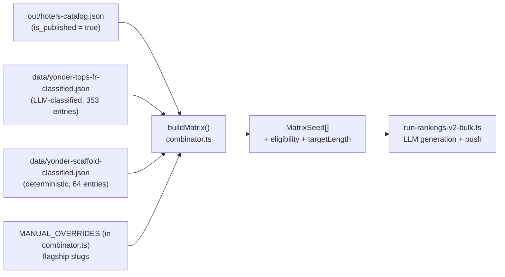

# Editorial rankings matrice — MyConciergeHotel.com

The `/classement/<slug>` URL space is generated programmatically from a
**matrice** of `MatrixSeed[]`. Each seed becomes a `editorial_rankings`
row + a generated long-read (≥ 3 500 mots, voix Concierge) + a ranked
list of hotels. The matrice is the single source of truth for **which
slugs exist on the site**, so every external slug (Yonder, Atout France,
Tablet Hotels) must end up in it. This skill is the contract.

## Triggers

Invoquer dès que :

- Un slug ne sort pas du combinator alors qu'il devrait (debug
  `inspect-matrix --filter=…` ou `inspect-scaffold-coverage.ts`).
- On bridge un nouveau corpus externe (Yonder, scraped competitor, etc.)
  dans la matrice.
- On ajoute un nouvel axe — `HotelType`, `Theme`, `Occasion`, `LieuDef`
  — ou on étend un schéma existant (postal_code, arrondissement,
  quartier).
- On modifie `lieuMatches`, `typeMatches`, `themeMatches` ou
  `buildMatrix` dans `combinator.ts`.
- On ajoute / modifie un `MANUAL_OVERRIDES` ou une décision A1/A2/A3
  sur un slug stratégique.
- On change le minimum d'éligibilité (`MIN_ELIGIBLE = 3`) ou la cible
  de longueur par scope.

## Architecture (vue d'oiseau)



Quatre **sources** de seeds, ingestion dans cet ordre de priorité :

1. **`MANUAL_OVERRIDES`** (haut) — flagship slugs avec axes + slug + titre explicites. Toujours émis (même `eligibleCount < MIN_ELIGIBLE`).
2. **`yonderScaffoldClassified`** — slugs URL Yonder qu'on a déjà scaffoldés en Supabase ; on utilise **`slugOverride`** pour préserver la canonical URL.
3. **`yonderClassified`** — corpus historique Yonder (353 entrées, classifiées via LLM dans `classify-yonder-axes.ts`) ; ces seeds **rendent** leur slug via `templates.ts` (le `yonderSlug` original n'est conservé qu'en métadonnée).
4. **Auto matrix** (bas) — produit cartésien (`HotelType` × `LieuDef`), (`Theme` × `LieuDef`), (`Occasion` × `france`).

À chaque étape, dédup par slug (la priorité plus haute gagne).

## Rule 1 — `slugOverride` quand le slug doit rester verbatim

Le combinator **rend** le slug par défaut via `templates.ts` à partir des
axes. Pour des slugs externes qu'on veut conserver mot-pour-mot (Yonder
URL, partenaire éditorial, accord SEO), passer `slugOverride` à
`buildSeed`. C'est l'arbitrage **A2** (mai 2026) — `Decision A2 / Yonder
scaffold expansion`.

```ts
// ❌ Mauvais — le slug est rendu par templates.ts à partir des axes
// (ex : Yonder URL `meilleurs-hotels-amoureux-france` devient
// `meilleurs-hotels-romantiques-france` via T8). Cassage SEO si la
// page Yonder référençait l'ancien slug.
buildSeed({ axes, source: 'yonder', catalog });

// ✅ Bon — le slug Yonder devient canonique, les axes servent
// uniquement à l'éligibilité.
buildSeed({
  axes,
  source: 'yonder',
  catalog,
  slugOverride: y.slug, // ← le slug Yonder est canonique
  titleFrOverride: y.titleFr,
  titleEnOverride: y.titleEn,
});
```

**Quand utiliser `slugOverride`** :

- Slug externe qu'on veut préserver (continuité SEO).
- Slug qui ne sortirait pas naturellement de `templates.ts` (vocabulaire
  vernaculaire : `amoureux`, `lifestyle`, `vue-mer`, `tour-eiffel`).
- Slug qui dépend d'un axe absent (Paris arrdt, quartier nommé).

**Quand NE PAS utiliser `slugOverride`** :

- Slug qui découle proprement d'axes canoniques — laisser le template
  rendre garantit la cohérence du graphe d'URLs.

## Rule 2 — `postalCodePrefixes` pour Paris arrondissements et quartiers

L'éligibilité géographique par défaut est : `h.city ∈ lieu.hotelCityKeys`.
**Trop permissif** pour Paris : un hôtel `city = "Paris", postal_code =
"75008"` matchait toutes les lieus parisiennes (incl. `paris-2` et
`marais`). Le champ optionnel `postalCodePrefixes` sur `LieuDef` corrige
ça en ajoutant un filtre `postal_code` post-`city`.

```ts
// axes.ts — déclaration
{
  slug: 'paris-8',
  label: 'Paris 8e',
  scope: 'arrondissement',
  hotelCityKeys: ['paris'],
  postalCodePrefixes: ['75008'],
},
{
  slug: 'champs-elysees',
  label: 'Champs-Élysées (Paris 8e)',
  scope: 'arrondissement',
  hotelCityKeys: ['paris'],
  postalCodePrefixes: ['75008'], // quartier = même arrdt
},
{
  slug: 'tour-eiffel',
  label: 'Tour Eiffel (Paris 7e)',
  scope: 'arrondissement',
  hotelCityKeys: ['paris'],
  postalCodePrefixes: ['75007', '75015', '75016'], // multi-arrdt
},
```

```ts
// combinator.ts — lieuMatches
function lieuMatches(h: HotelCatalogRow, lieu: LieuDef): boolean {
  if (lieu.slug === 'france') return true;
  const cityMatch = lieu.hotelCityKeys.some(
    (k) => lc(h.city) === lc(k) || lc(h.city).includes(lc(k)),
  );
  if (!cityMatch) return false;
  if (lieu.postalCodePrefixes !== undefined) {
    const pc = (h.postal_code ?? '').replace(/\s+/gu, '');
    return lieu.postalCodePrefixes.some((p) => pc.startsWith(p));
  }
  return true;
}
```

**Toujours préférer `postalCodePrefixes` à un nouveau scope.** Ajouter
un `quartier` scope demanderait une nouvelle colonne `hotels.quartier`
(éditorial humain → coût) alors que le postal_code existe déjà partout.

## Rule 3 — Classifier déterministe vs LLM

Le repo a **deux classifiers Yonder** — savoir lequel utiliser est
contre-intuitif et coûteux en cycles si on se trompe.

| Cas                              | Classifier                                                                                                                               | Coût                 | Note                                                                   |
| -------------------------------- | ---------------------------------------------------------------------------------------------------------------------------------------- | -------------------- | ---------------------------------------------------------------------- |
| Titres libres + URLs noisy       | [`classify-yonder-axes.ts`](../../scripts/editorial-pilot/src/yonder/classify-yonder-axes.ts) (LLM)                                      | ~$0.04 / 353 entrées | Pour le corpus historique Yonder (titres en langage naturel).          |
| Slugs déjà normalisés kebab-case | [`classify-scaffold-axes.ts`](../../scripts/editorial-pilot/src/yonder/classify-scaffold-axes.ts) (déterministe, parsing + alias tables) | **$0** (pas de LLM)  | Pour `yonder/scaffold-plans.json` ou tout corpus avec slug-as-payload. |

**Règle empirique** :

- Si le slug d'entrée respecte `meilleurs-hotels-<lieu|theme|occasion>-<scope>`, parser via lookup tables. Aucun LLM nécessaire.
- Si l'entrée est un titre libre (`"10 hôtels de charme à moins d'1h30 de Paris"`), LLM seul fiable.

Anti-pattern : appeler le LLM sur 64 slugs structurés alors qu'un Map<string, axes> suffit.

## Rule 4 — Ordre des sources dans `buildMatrix` (priorité de slug)

Quand deux sources émettent le même slug, **la première gagne**. L'ordre
canonique de `buildMatrix` est :

```
1. MANUAL_OVERRIDES        ─┐
2. yonderScaffoldClassified ─┤ "haute curation" (slug verbatim)
3. yonderClassified         ─┤ "moyenne curation" (LLM-classified)
4. auto matrix (type×lieu, theme×lieu, occasion×france)
```

Ne **jamais** insérer une nouvelle source entre 1 et 2 sans réfléchir à
l'effet sur les slugs déjà en DB : un slug surclassé bascule de source
et perd potentiellement son override de titre / `kind`.

## Rule 5 — Eligibility floor et `skipUnderfilled`

`MIN_ELIGIBLE = 3` en production. Trois leviers :

- `skipUnderfilled = true` (défaut prod) → drop des seeds avec `eligibleCount < 3`.
- `skipUnderfilled = false` (QA) → conserver tous les seeds (utile pour audit).
- `MANUAL_OVERRIDES` → émis **toujours**, même si underfilled (pour ne pas perdre une page flagship en l'absence temporaire d'hôtels).

```ts
// inspect-scaffold-coverage.ts — diagnostic recommandé après ajout
// d'une source / d'un axe :
const eligibility = new Map<string, number>();
for (const s of matrix.seeds) {
  if (scaffoldSlugs.includes(s.slug)) eligibility.set(s.slug, s.eligibleCount);
}
```

À chaque vague de publication, le ratchet d'éligibilité débloque
naturellement de nouveaux slugs sans changement de code.

## Rule 6 — Ne pas hardcoder l'ordre de matchers `lieuMatches`

`resolveLieu(raw)` est appelé en chaîne (exact → label normalisé →
heuristique city-key). Ajouter un alias spécifique (`cote-azur` →
`cote-d-azur`, `cap-ferret` → `cote-atlantique`) doit se faire dans le
classifier (`LIEU_SLUG_ALIASES` dans `classify-scaffold-axes.ts`), **pas
dans `resolveLieu`** qui est partagé par tous les chemins. Modifier
`resolveLieu` impacte aussi la pipeline LLM et peut casser des
classifications déjà persistées.

## Anti-patterns à refuser

- **Slug duplicate avec différents `axes`** entre `MANUAL_OVERRIDES` et `yonderScaffoldClassified` → bug silencieux : la première source gagne, la seconde voit son `kind`/title écrasés. Faire `inspect-scaffold-coverage.ts` après chaque ajout.
- **`axes.lieu.slug = 'paris'` pour un slug Yonder de quartier** sans `postalCodePrefixes` → éligibilité sur-permissive, le LLM sélectionne des hôtels du mauvais arrondissement.
- **Nouveau template dans `templates.ts`** pour matcher un slug externe → préfèrer `slugOverride`. Les templates doivent rester génératifs (axes → slug), pas réactifs (slug → axes).
- **Skipper la validation `inspect-matrix`** après ajout d'un axe → la matrice peut exploser (cartesian × N) sans qu'on le voie immédiatement. Toujours comparer `emittedSeeds` avant/après.
- **LLM pour classifier des slugs déjà structurés** → cf. Rule 3.
- **Pousser un slug avec `eligibleCount = 0`** via `--include-underfilled` en prod → la page existe mais affiche une liste vide.

## Workflow recommandé (nouveau corpus externe)

```bash
# 1. Extraire les slugs + métadonnées brutes (Tavily, scrape, etc.).
pnpm --filter @mch/editorial-pilot exec tsx src/<source>/extract-<source>.ts

# 2. Si slugs structurés → classifier déterministe.
# Si titres libres → classifier LLM.
pnpm --filter @mch/editorial-pilot exec tsx src/<source>/classify-<source>-axes.ts

# 3. Brancher dans rankings-catalog-v2.ts (load + pass to buildMatrix).
# 4. Inspecter — TOUJOURS — avant de lancer rankings:bulk.
pnpm --filter @mch/editorial-pilot exec tsx \
  src/rankings/inspect-scaffold-coverage.ts

# 5. Dry-run d'un sample.
pnpm rankings:bulk:dry "--only=<slug1>,<slug2>,<slug3>"

# 6. Génération réelle avec --draft (publish=false jusqu'à audit).
pnpm rankings:bulk --source=yonder --draft
```

## Fichiers du squelette

| Fichier                                                                                                   | Rôle                                                                        |
| --------------------------------------------------------------------------------------------------------- | --------------------------------------------------------------------------- |
| [`axes.ts`](../../scripts/editorial-pilot/src/rankings/axes.ts)                                           | `HotelType`, `Theme`, `Occasion`, `LieuDef`, `RankingAxes`, `resolveLieu`.  |
| [`templates.ts`](../../scripts/editorial-pilot/src/rankings/templates.ts)                                 | 9 templates : `axes → slug + titre`. Pure string functions.                 |
| [`combinator.ts`](../../scripts/editorial-pilot/src/rankings/combinator.ts)                               | `buildMatrix()`, `eligibilityFor()`, `MANUAL_OVERRIDES`, `lieuMatches`.     |
| [`rankings-catalog-v2.ts`](../../scripts/editorial-pilot/src/rankings/rankings-catalog-v2.ts)             | Loader public — assemble catalog + classified sources + buildMatrix.        |
| [`run-rankings-v2-bulk.ts`](../../scripts/editorial-pilot/src/rankings/run-rankings-v2-bulk.ts)           | CLI batch runner (concurrent, cache, draft mode, dry-run).                  |
| [`inspect-matrix.ts`](../../scripts/editorial-pilot/src/rankings/inspect-matrix.ts)                       | Diagnostic stats + filter (rapide).                                         |
| [`inspect-scaffold-coverage.ts`](../../scripts/editorial-pilot/src/rankings/inspect-scaffold-coverage.ts) | Diagnostic spécifique scaffold (coverage 64/64 + distribution eligibility). |
| [`yonder/classify-yonder-axes.ts`](../../scripts/editorial-pilot/src/yonder/classify-yonder-axes.ts)      | Classifier LLM (titres libres).                                             |
| [`yonder/classify-scaffold-axes.ts`](../../scripts/editorial-pilot/src/yonder/classify-scaffold-axes.ts)  | Classifier déterministe (slugs structurés).                                 |

## References

- [`editorial-long-read-rendering`](../editorial-long-read-rendering/SKILL.md) — comment le seed (`MatrixSeed`) devient un long-read rendu (sticky TOC, callouts, EEAT footer). La matrice produit le seed ; cette skill rend la page.
- [`concierge-voice-pipeline`](../concierge-voice-pipeline/SKILL.md) — comment la voix Concierge est appliquée au contenu généré à partir d'un seed (pass 8, shortener phrases > 25 mots).
- [`llm-output-robustness`](../llm-output-robustness/SKILL.md) — multi-call pipelines, schema drift tolerance — pour les classifiers LLM (`classify-yonder-axes.ts`).
- [`content-enrichment-pipeline`](../content-enrichment-pipeline/SKILL.md) — enrichissement factuel des hôtels (DATAtourisme, Wikidata) qui débloque l'éligibilité des seeds.
- [`seo-technical`](../seo-technical/SKILL.md) — anti-cannibalisation entre slugs proches (`meilleurs-hotels-corse` vs `plus-beaux-hotels-corse`).
- [`supabase-postgres-rls`](../supabase-postgres-rls/SKILL.md) — la table `editorial_rankings` où les seeds générés atterrissent.
