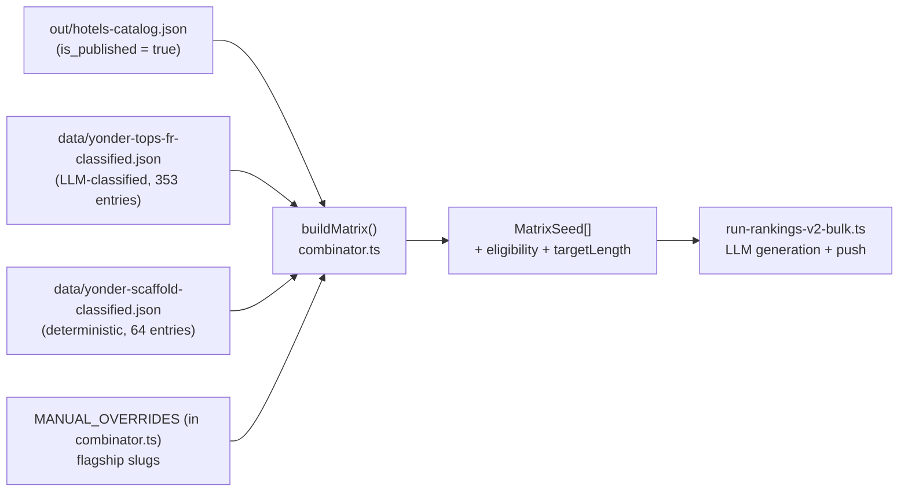

# Editorial rankings matrice — MyConciergeHotel.com

The `/classement/<slug>` URL space is generated programmatically from a
**matrice** of `MatrixSeed[]`. Each seed becomes a `editorial_rankings`
row + a generated long-read (≥ 3 500 mots, voix Concierge) + a ranked
list of hotels. The matrice is the single source of truth for **which
slugs exist on the site**, so every external slug (Yonder, Atout France,
Tablet Hotels) must end up in it. This skill is the contract.

## Triggers

Invoquer dès que :

- Un slug ne sort pas du combinator alors qu'il devrait (debug
  `inspect-matrix --filter=…` ou `inspect-scaffold-coverage.ts`).
- On bridge un nouveau corpus externe (Yonder, scraped competitor, etc.)
  dans la matrice.
- On ajoute un nouvel axe — `HotelType`, `Theme`, `Occasion`, `LieuDef`
  — ou on étend un schéma existant (postal_code, arrondissement,
  quartier).
- On modifie `lieuMatches`, `typeMatches`, `themeMatches` ou
  `buildMatrix` dans `combinator.ts`.
- On ajoute / modifie un `MANUAL_OVERRIDES` ou une décision A1/A2/A3
  sur un slug stratégique.
- On change le minimum d'éligibilité (`MIN_ELIGIBLE = 3`) ou la cible
  de longueur par scope.

## Architecture (vue d'oiseau)


```mermaid
flowchart LR
  catalog["out/hotels-catalog.json<br/>(is_published = true)"] --> combinator
  yonderClassified["data/yonder-tops-fr-classified.json<br/>(LLM-classified, 353 entries)"] --> combinator
  yonderScaffold["data/yonder-scaffold-classified.json<br/>(deterministic, 64 entries)"] --> combinator
  manual["MANUAL_OVERRIDES (in combinator.ts)<br/>flagship slugs"] --> combinator
  combinator["buildMatrix()<br/>combinator.ts"] --> seeds["MatrixSeed[]<br/>+ eligibility + targetLength"]
  seeds --> bulk["run-rankings-v2-bulk.ts<br/>LLM generation + push"]
```

Quatre **sources** de seeds, ingestion dans cet ordre de priorité :

1. **`MANUAL_OVERRIDES`** (haut) — flagship slugs avec axes + slug + titre explicites. Toujours émis (même `eligibleCount < MIN_ELIGIBLE`).
2. **`yonderScaffoldClassified`** — slugs URL Yonder qu'on a déjà scaffoldés en Supabase ; on utilise **`slugOverride`** pour préserver la canonical URL.
3. **`yonderClassified`** — corpus historique Yonder (353 entrées, classifiées via LLM dans `classify-yonder-axes.ts`) ; ces seeds **rendent** leur slug via `templates.ts` (le `yonderSlug` original n'est conservé qu'en métadonnée).
4. **Auto matrix** (bas) — produit cartésien (`HotelType` × `LieuDef`), (`Theme` × `LieuDef`), (`Occasion` × `france`).

À chaque étape, dédup par slug (la priorité plus haute gagne).

## Rule 1 — `slugOverride` quand le slug doit rester verbatim

Le combinator **rend** le slug par défaut via `templates.ts` à partir des
axes. Pour des slugs externes qu'on veut conserver mot-pour-mot (Yonder
URL, partenaire éditorial, accord SEO), passer `slugOverride` à
`buildSeed`. C'est l'arbitrage **A2** (mai 2026) — `Decision A2 / Yonder
scaffold expansion`.

```ts
// ❌ Mauvais — le slug est rendu par templates.ts à partir des axes
// (ex : Yonder URL `meilleurs-hotels-amoureux-france` devient
// `meilleurs-hotels-romantiques-france` via T8). Cassage SEO si la
// page Yonder référençait l'ancien slug.
buildSeed({ axes, source: 'yonder', catalog });

// ✅ Bon — le slug Yonder devient canonique, les axes servent
// uniquement à l'éligibilité.
buildSeed({
  axes,
  source: 'yonder',
  catalog,
  slugOverride: y.slug, // ← le slug Yonder est canonique
  titleFrOverride: y.titleFr,
  titleEnOverride: y.titleEn,
});
```

**Quand utiliser `slugOverride`** :

- Slug externe qu'on veut préserver (continuité SEO).
- Slug qui ne sortirait pas naturellement de `templates.ts` (vocabulaire
  vernaculaire : `amoureux`, `lifestyle`, `vue-mer`, `tour-eiffel`).
- Slug qui dépend d'un axe absent (Paris arrdt, quartier nommé).

**Quand NE PAS utiliser `slugOverride`** :

- Slug qui découle proprement d'axes canoniques — laisser le template
  rendre garantit la cohérence du graphe d'URLs.

## Rule 2 — `postalCodePrefixes` pour Paris arrondissements et quartiers

L'éligibilité géographique par défaut est : `h.city ∈ lieu.hotelCityKeys`.
**Trop permissif** pour Paris : un hôtel `city = "Paris", postal_code =
"75008"` matchait toutes les lieus parisiennes (incl. `paris-2` et
`marais`). Le champ optionnel `postalCodePrefixes` sur `LieuDef` corrige
ça en ajoutant un filtre `postal_code` post-`city`.

```ts
// axes.ts — déclaration
{
  slug: 'paris-8',
  label: 'Paris 8e',
  scope: 'arrondissement',
  hotelCityKeys: ['paris'],
  postalCodePrefixes: ['75008'],
},
{
  slug: 'champs-elysees',
  label: 'Champs-Élysées (Paris 8e)',
  scope: 'arrondissement',
  hotelCityKeys: ['paris'],
  postalCodePrefixes: ['75008'], // quartier = même arrdt
},
{
  slug: 'tour-eiffel',
  label: 'Tour Eiffel (Paris 7e)',
  scope: 'arrondissement',
  hotelCityKeys: ['paris'],
  postalCodePrefixes: ['75007', '75015', '75016'], // multi-arrdt
},
```

```ts
// combinator.ts — lieuMatches
function lieuMatches(h: HotelCatalogRow, lieu: LieuDef): boolean {
  if (lieu.slug === 'france') return true;
  const cityMatch = lieu.hotelCityKeys.some(
    (k) => lc(h.city) === lc(k) || lc(h.city).includes(lc(k)),
  );
  if (!cityMatch) return false;
  if (lieu.postalCodePrefixes !== undefined) {
    const pc = (h.postal_code ?? '').replace(/\s+/gu, '');
    return lieu.postalCodePrefixes.some((p) => pc.startsWith(p));
  }
  return true;
}
```

**Toujours préférer `postalCodePrefixes` à un nouveau scope.** Ajouter
un `quartier` scope demanderait une nouvelle colonne `hotels.quartier`
(éditorial humain → coût) alors que le postal_code existe déjà partout.

## Rule 3 — Classifier déterministe vs LLM

Le repo a **deux classifiers Yonder** — savoir lequel utiliser est
contre-intuitif et coûteux en cycles si on se trompe.

| Cas                              | Classifier                                                                                                                               | Coût                 | Note                                                                   |
| -------------------------------- | ---------------------------------------------------------------------------------------------------------------------------------------- | -------------------- | ---------------------------------------------------------------------- |
| Titres libres + URLs noisy       | [`classify-yonder-axes.ts`](../../scripts/editorial-pilot/src/yonder/classify-yonder-axes.ts) (LLM)                                      | ~$0.04 / 353 entrées | Pour le corpus historique Yonder (titres en langage naturel).          |
| Slugs déjà normalisés kebab-case | [`classify-scaffold-axes.ts`](../../scripts/editorial-pilot/src/yonder/classify-scaffold-axes.ts) (déterministe, parsing + alias tables) | **$0** (pas de LLM)  | Pour `yonder/scaffold-plans.json` ou tout corpus avec slug-as-payload. |

**Règle empirique** :

- Si le slug d'entrée respecte `meilleurs-hotels-<lieu|theme|occasion>-<scope>`, parser via lookup tables. Aucun LLM nécessaire.
- Si l'entrée est un titre libre (`"10 hôtels de charme à moins d'1h30 de Paris"`), LLM seul fiable.

Anti-pattern : appeler le LLM sur 64 slugs structurés alors qu'un Map<string, axes> suffit.

## Rule 4 — Ordre des sources dans `buildMatrix` (priorité de slug)

Quand deux sources émettent le même slug, **la première gagne**. L'ordre
canonique de `buildMatrix` est :

```
1. MANUAL_OVERRIDES        ─┐
2. yonderScaffoldClassified ─┤ "haute curation" (slug verbatim)
3. yonderClassified         ─┤ "moyenne curation" (LLM-classified)
4. auto matrix (type×lieu, theme×lieu, occasion×france)
```

Ne **jamais** insérer une nouvelle source entre 1 et 2 sans réfléchir à
l'effet sur les slugs déjà en DB : un slug surclassé bascule de source
et perd potentiellement son override de titre / `kind`.

## Rule 5 — Eligibility floor et `skipUnderfilled`

`MIN_ELIGIBLE = 3` en production. Trois leviers :

- `skipUnderfilled = true` (défaut prod) → drop des seeds avec `eligibleCount < 3`.
- `skipUnderfilled = false` (QA) → conserver tous les seeds (utile pour audit).
- `MANUAL_OVERRIDES` → émis **toujours**, même si underfilled (pour ne pas perdre une page flagship en l'absence temporaire d'hôtels).

```ts
// inspect-scaffold-coverage.ts — diagnostic recommandé après ajout
// d'une source / d'un axe :
const eligibility = new Map<string, number>();
for (const s of matrix.seeds) {
  if (scaffoldSlugs.includes(s.slug)) eligibility.set(s.slug, s.eligibleCount);
}
```

À chaque vague de publication, le ratchet d'éligibilité débloque
naturellement de nouveaux slugs sans changement de code.

## Rule 6 — `is_published` doit être un ratchet, jamais un assignment

**Regression incident — 2026-05-19.** `pnpm rankings:bulk --source=yonder
--draft` a démoté **14 rankings publiés** (`meilleurs-hotels-5-etoiles-france`,
`meilleurs-hotels-spa-france`, `plus-beaux-5-etoiles-france`, etc.) à `is_published
= false` en quelques secondes, parce que la clause `on conflict do update` de
[`push-ranking-v2.ts`](../../scripts/editorial-pilot/src/rankings/push-ranking-v2.ts)
écrasait inconditionnellement `is_published`.

```sql
-- ❌ Bad — un re-push avec --draft flip toutes les pages SEO live à draft
on conflict (slug) do update set
  ...
  is_published = excluded.is_published

-- ✅ Bon — ratchet : ne jamais redescendre publié → draft via le bulk pipeline
on conflict (slug) do update set
  ...
  is_published = (editorial_rankings.is_published OR excluded.is_published)
```

**Pourquoi** : le bulk runner consomme un cache disque
(`data/rankings-cache/<slug>/generated.json`). Une fois qu'un slug a été généré
puis publié, **toute** invocation ultérieure de `rankings:bulk --draft` (par
exemple pour scaffolder une nouvelle vague Yonder) va re-pousser ce slug avec
`publish=false` et le faire passer en draft. Le bug s'étend à
`push-guide-v2.ts` (même pattern).

**Le bulk pipeline doit "publish forward, never unpublish silently"**.
L'unpublishing est une opération admin explicite (Payload back-office ou SQL
direct), pas un side-effect d'un re-push.

Anti-pattern associé : tester avec `--draft` "pour être prudent" sur un corpus
qui contient des slugs déjà publiés. **Avec le ratchet en place, `--draft` est
sûr**. Sans le ratchet, c'est un fusil à pompe.

## Rule 8 — Chain rankings hors matrice (workflow PostgREST direct)

Quand on veut produire un **cross-chain ranking** (`Top 25 Aman`, `Top 30
Four Seasons palaces`, `Best Mandarin Oriental`, etc.) on **ne passe pas
par la matrice combinator**. Raison : ces rankings ne se déduisent pas
d'axes (`lieu × type × theme`) — ils sont définis par un filtre brand-
specific (`luxury_tier = 'aman'` + `name ILIKE '%aman%'`) qui n'a pas
sa place dans `buildMatrix()`. Les forcer dans la matrice pollue les
axes et complique `inspect-matrix`.

Le workflow validé (Phase 4.B 2026-05-28) :

1. **Seed déclaratif** dans `src/rankings/run-chain-ranking.ts`
   (`CHAIN_SPECS`) — un objet `{ slug, axisChainKey, titleFr, titleEn,
topN, eligibilityFilter? }` par marque.
2. **Dump SQL par chaîne** via `split-chain-dump.mjs` (entrée = bulk
   SQL dump depuis MCP `execute_sql`, sortie = un JSON normalisé
   `HotelCatalogRow[]` par chaîne dans `out/chain-hotels/<chain>.json`).
3. **Génération LLM** par `run-chain-ranking.ts` (réutilise
   `generateRankingV2` — même multi-call que le bulk runner). Sortie
   cachée localement dans `data/rankings-cache/<slug>/generated.json`
   - `seed.json`.
4. **Push DB** via `push-ranking-via-rest.mjs` — PostgREST direct (pas
   d'`apply_migration` / `execute_sql` MCP — les payloads dépassent
   souvent les 50K tokens). Le script applique le ratchet `is_published`
   (Rule 6), tronque `justification_fr/en` à 1200 chars (check
   constraint), et émet les bons `toc_anchors` (`introduction`,
   `tableaux`, `ranking`, `glossaire`, `conclusion`, `faq`, `sources`
   — IDs exacts utilisés par
   [`apps/web/src/app/[locale]/classement/[slug]/page.tsx`](../../apps/web/src/app/[locale]/classement/[slug]/page.tsx)).
5. **Verify** via `verify-chain-rankings.mjs` — lit la DB via PostgREST,
   confirme `is_published = true` + dump le slug réellement persisté
   (le suffix `-hotels-monde` vs `-monde` peut différer entre `CHAIN_SPECS`
   et la DB selon la convention de la chaîne).
6. **Unpublish legacy** — quand on rebuild une chaîne déjà couverte par
   un slug contaminé (Aman, FS, MO, PH ont été live avec des hôtels
   hors-marque jusqu'au 2026-05-28), `update editorial_rankings set
is_published = false where slug = '<legacy_slug>'` pour éviter la
   cannibalisation SEO.

**Pourquoi pas `execute_sql` MCP pour le push** : les 25-30 entrées
contiennent chacune 1000+ chars de markdown FR + EN. Le SQL transaction
dépasse les 32K tokens et fait tomber l'outil MCP avec un message
opaque. PostgREST avale les payloads sans broncher et donne des erreurs
claires par row (cf. l'incident `justification_fr_ck` qui a été
diagnostiqué en une requête PostgREST).

## Rule 7 — Ne pas hardcoder l'ordre de matchers `lieuMatches`

`resolveLieu(raw)` est appelé en chaîne (exact → label normalisé →
heuristique city-key). Ajouter un alias spécifique (`cote-azur` →
`cote-d-azur`, `cap-ferret` → `cote-atlantique`) doit se faire dans le
classifier (`LIEU_SLUG_ALIASES` dans `classify-scaffold-axes.ts`), **pas
dans `resolveLieu`** qui est partagé par tous les chemins. Modifier
`resolveLieu` impacte aussi la pipeline LLM et peut casser des
classifications déjà persistées.

## Anti-patterns à refuser

- **`on conflict do update set is_published = excluded.is_published`** dans n'importe quel `push-*` editorial — cf. Rule 6, incident du 2026-05-19. Le bulk pipeline ne doit jamais redescendre une page SEO en draft.
- **Slug duplicate avec différents `axes`** entre `MANUAL_OVERRIDES` et `yonderScaffoldClassified` → bug silencieux : la première source gagne, la seconde voit son `kind`/title écrasés. Faire `inspect-scaffold-coverage.ts` après chaque ajout.
- **`axes.lieu.slug = 'paris'` pour un slug Yonder de quartier** sans `postalCodePrefixes` → éligibilité sur-permissive, le LLM sélectionne des hôtels du mauvais arrondissement.
- **Nouveau template dans `templates.ts`** pour matcher un slug externe → préfèrer `slugOverride`. Les templates doivent rester génératifs (axes → slug), pas réactifs (slug → axes).
- **Skipper la validation `inspect-matrix`** après ajout d'un axe → la matrice peut exploser (cartesian × N) sans qu'on le voie immédiatement. Toujours comparer `emittedSeeds` avant/après.
- **LLM pour classifier des slugs déjà structurés** → cf. Rule 3.
- **Pousser un slug avec `eligibleCount = 0`** via `--include-underfilled` en prod → la page existe mais affiche une liste vide.

## Workflow recommandé (nouveau corpus externe)

```bash
# 1. Extraire les slugs + métadonnées brutes (Tavily, scrape, etc.).
pnpm --filter @mch/editorial-pilot exec tsx src/<source>/extract-<source>.ts

# 2. Si slugs structurés → classifier déterministe.
# Si titres libres → classifier LLM.
pnpm --filter @mch/editorial-pilot exec tsx src/<source>/classify-<source>-axes.ts

# 3. Brancher dans rankings-catalog-v2.ts (load + pass to buildMatrix).
# 4. Inspecter — TOUJOURS — avant de lancer rankings:bulk.
pnpm --filter @mch/editorial-pilot exec tsx \
  src/rankings/inspect-scaffold-coverage.ts

# 5. Dry-run d'un sample.
pnpm rankings:bulk:dry "--only=<slug1>,<slug2>,<slug3>"

# 6. Génération réelle avec --draft (publish=false jusqu'à audit).
pnpm rankings:bulk --source=yonder --draft
```

## Fichiers du squelette

| Fichier                                                                                                      | Rôle                                                                        |
| ------------------------------------------------------------------------------------------------------------ | --------------------------------------------------------------------------- |
| [`axes.ts`](../../scripts/editorial-pilot/src/rankings/axes.ts)                                              | `HotelType`, `Theme`, `Occasion`, `LieuDef`, `RankingAxes`, `resolveLieu`.  |
| [`templates.ts`](../../scripts/editorial-pilot/src/rankings/templates.ts)                                    | 9 templates : `axes → slug + titre`. Pure string functions.                 |
| [`combinator.ts`](../../scripts/editorial-pilot/src/rankings/combinator.ts)                                  | `buildMatrix()`, `eligibilityFor()`, `MANUAL_OVERRIDES`, `lieuMatches`.     |
| [`rankings-catalog-v2.ts`](../../scripts/editorial-pilot/src/rankings/rankings-catalog-v2.ts)                | Loader public — assemble catalog + classified sources + buildMatrix.        |
| [`run-rankings-v2-bulk.ts`](../../scripts/editorial-pilot/src/rankings/run-rankings-v2-bulk.ts)              | CLI batch runner (concurrent, cache, draft mode, dry-run).                  |
| [`inspect-matrix.ts`](../../scripts/editorial-pilot/src/rankings/inspect-matrix.ts)                          | Diagnostic stats + filter (rapide).                                         |
| [`inspect-scaffold-coverage.ts`](../../scripts/editorial-pilot/src/rankings/inspect-scaffold-coverage.ts)    | Diagnostic spécifique scaffold (coverage 64/64 + distribution eligibility). |
| [`yonder/classify-yonder-axes.ts`](../../scripts/editorial-pilot/src/yonder/classify-yonder-axes.ts)         | Classifier LLM (titres libres).                                             |
| [`yonder/classify-scaffold-axes.ts`](../../scripts/editorial-pilot/src/yonder/classify-scaffold-axes.ts)     | Classifier déterministe (slugs structurés).                                 |
| [`rankings/run-chain-ranking.ts`](../../scripts/editorial-pilot/src/rankings/run-chain-ranking.ts)           | Chain rankings (Rule 8) — `CHAIN_SPECS` + génération LLM par marque.        |
| [`rankings/split-chain-dump.mjs`](../../scripts/editorial-pilot/src/rankings/split-chain-dump.mjs)           | Dump SQL → JSON normalisé par chaîne dans `out/chain-hotels/`.              |
| [`rankings/push-ranking-via-rest.mjs`](../../scripts/editorial-pilot/src/rankings/push-ranking-via-rest.mjs) | Push d'un ranking en DB via PostgREST (ratchet + truncation + TOC).         |
| [`rankings/verify-chain-rankings.mjs`](../../scripts/editorial-pilot/src/rankings/verify-chain-rankings.mjs) | Check existence + statut publish des chain slugs.                           |

## Enriching per-entry justifications (beat-yonder, 2026-06-23)

The N1 gap vs yonder.fr is per-entry justification richness
(`editorial_ranking_entries.justification_fr/_en`): yonder names the architect,
the Michelin table (chef + star count), the suite to book, a dated distinction.
The surgical enricher is
[`enrich-ranking-justifications.ts`](../../scripts/editorial-pilot/src/rankings/enrich-ranking-justifications.ts)
(PATCHes only `justification_*` by `(ranking_id, hotel_id)`, grounded on the
hotel row, `hasLeak()`-gated, PostgREST-only). Lessons capitalised:

- **EN length is NOT a quality proxy.** After the EN-parity backfill, ~all
  published entries already have `justification_en >= 120`, so the original
  `--min-en` selection (rewrite where EN is short) skips every generic-but-long
  entry. The catalogue heads (`hotel-de-luxe-<ville>`, `meilleurs-palaces-*`,
  benchmarked city heads) are already concrete; the residual generic prose is in
  the **chain rankings** (`top-*-monde`) and tail/secondary cities (~810 entries
  / 237 rankings as of 2026-06-23). Use the new `--generic-only` flag, which
  targets entries naming no hard fact (architect/Michelin/dated distinction/year/
  suite/dimension) OR omitting a starred table the row actually carries.
- **`restaurant_info` / `spa_info` were fetched but never rendered** into the
  grounding facts. `restaurant_info.venues[]` carries `name` + `chef` +
  `michelin_stars` (e.g. "Seta by Antonio Guida", 2 stars) — exactly the
  named-table signal yonder leads with. `buildHotelFacts` now renders both
  (hotel's own structured data, zero invention). Always audit which fetched
  columns actually reach the prompt before assuming the LLM "ignored" a fact.
- **LLM-provider blocker (2026-06-23):** the OpenAI key returns `429
insufficient_quota` (account billing exhausted, all models incl. `-mini`),
  and the only `ANTHROPIC_API_KEY` slot in `.env.local` is empty. This is a
  hard external block, not a throttle — probe-and-resume does not help; the
  enrichment run waits on a funded provider key.
- **Shared-working-tree commit race:** a parallel worker edits
  `editorial-table.tsx` / `get-ranking-by-slug.ts` (the `tables` concern) in
  the SAME tree. `git add <my-file>` then commit can sweep in their staged
  files. Commit by pathspec (`git commit -F msg -- <my-file>`) and expect the
  repo-wide `pre-push` typecheck to fail on their in-progress syntax errors;
  wait and retry rather than `--no-verify`.

### Resume + head-term concretisation run (2026-06-26)

The 2026-06-23 provider block cleared (OpenAI `gpt-5.4` funded again), so the
run that was waiting finally executed. Targeting decision worth reusing:

- **Top-volume acquisition set = the 30 `hotel-de-luxe-<ville>` slugs.** Per the
  yonder audit, `hôtel de luxe {ville}` is the dominant-volume head-term family
  (10-30× `meilleurs hôtels {ville}`), so those 30 slugs ARE the "top 20-30
  acquisition cities" — no extra DataForSEO ranking call needed to pick them, the
  slug family already encodes the demand. Run `--generic-only --grounded` over
  the explicit `--slugs=` list; concrete cities report `0 need work (skip)` at
  **zero LLM cost**, so the spend self-concentrates on the genuinely-generic
  cities.
- **Result:** 27/30 rankings touched, **73 entries updated, 0 leak-skip, 0
  errors**. The generic residual on the heads was concentrated in a handful of
  cities (`bali` 10/10, `santorin` 6/8, `bangkok` 6/8, `florence` 5/8, `vienne`
  5/8, `marrakech`/`abu-dhabi`/`doha`/`mykonos` 4/8) — Paris/London/Monaco were
  already fully concrete and skipped. So the 2026-06-23 claim "the heads are
  already concrete" was **only ~80 % true**: ~16 % of head-podiums still shipped
  generic brand-speak (e.g. `vienne #1` was live with the banned phrase
  **"s'impose naturellement"** + an `exceptional` superlative in EN).
- **`--generic-only` also restores EN parity for free.** Several heads shipped a
  concrete-ish FR but a ~110-128-char EN _stub_ (the EN-parity backfill had
  missed `bali`/`bangkok`/`florence`/`vienne`). Because the rewrite emits both
  locales in one call, every generic entry it touched came back FR≈EN≈850 chars.
  Residual gap: an entry with concrete FR + stub EN is NOT a `--generic-only`
  target — for those, a second `--min-en=130` pass (no `--generic-only`) is the
  follow-up (a few entries, e.g. `berlin #1`).
- **PAA coverage reads LOW but is noise-dominated, not a quality miss.** Many
  heads logged `dfs_paa_coverage` 13-43 % because the uncovered PAA are
  out-of-scope by design: price ("combien coûte une nuit au Ritz", "prix d'une
  nuit à Shangri-La" — frozen until Phase 6) and celebrity/wealth ("où logent
  les milliardaires", "où vont les riches au ski", "seul hôtel 7 étoiles"). The
  on-topic PAA (location/dining/access) ARE covered. Don't chase the headline %
  on these head-terms — it's a denominator artefact, non-blocking by design.

## EN translation gate pitfalls (2026-06-29 — ranking EN-parity remediation)

Two reusable lessons from closing the catalogue-wide EN-parity gap (795 `intro_en`
stubs + 2,912 stub `justification_en` + 272 rankings missing EN sections, via the
`translate-rankings-{intro-factual,justifications,sections}-en.ts` tools):

- **An all-or-nothing `intro + factual_summary` gate silently discards a perfect
  intro.** `translate-rankings-intro-factual-en.ts` validated `intro_en` AND
  `factual_summary_en` together: when a thin FR `factual_summary` (~120c) produced
  a faithful EN of ~108c — 2c under the 110c floor — the whole write (including the
  ~4,800c long-read intro) was dropped to FR fallback. Fix: write the intro
  independently of the factual_summary, or pre-seed a faithful >=110c
  `factual_summary_en`. Size a coupled validation gate to the WEAKEST field, or
  decouple the writes.
- **FR-source scaffolding leaks block faithful EN translation.** A `ce dossier`
  leak in `intro_fr` is inherited by the faithful EN translation and then
  gate-dropped by `hasLeak()`. Unlike the sections/justifications tools (which
  sentence-salvage), the intro tool dropped the whole body. Fix the FR source
  first (strip the leaky sentence), or give the intro tool sentence-level salvage.
  See `concierge-voice-pipeline` scaffolding-leak history.

## References

- [`editorial-long-read-rendering`](../editorial-long-read-rendering/SKILL.md) — comment le seed (`MatrixSeed`) devient un long-read rendu (sticky TOC, callouts, EEAT footer). La matrice produit le seed ; cette skill rend la page.
- [`concierge-voice-pipeline`](../concierge-voice-pipeline/SKILL.md) — comment la voix Concierge est appliquée au contenu généré à partir d'un seed (pass 8, shortener phrases > 25 mots).
- [`llm-output-robustness`](../llm-output-robustness/SKILL.md) — multi-call pipelines, schema drift tolerance — pour les classifiers LLM (`classify-yonder-axes.ts`).
- [`content-enrichment-pipeline`](../content-enrichment-pipeline/SKILL.md) — enrichissement factuel des hôtels (DATAtourisme, Wikidata) qui débloque l'éligibilité des seeds.
- [`seo-technical`](../seo-technical/SKILL.md) — anti-cannibalisation entre slugs proches (`meilleurs-hotels-corse` vs `plus-beaux-hotels-corse`).
- [`supabase-postgres-rls`](../supabase-postgres-rls/SKILL.md) — la table `editorial_rankings` où les seeds générés atterrissent.
