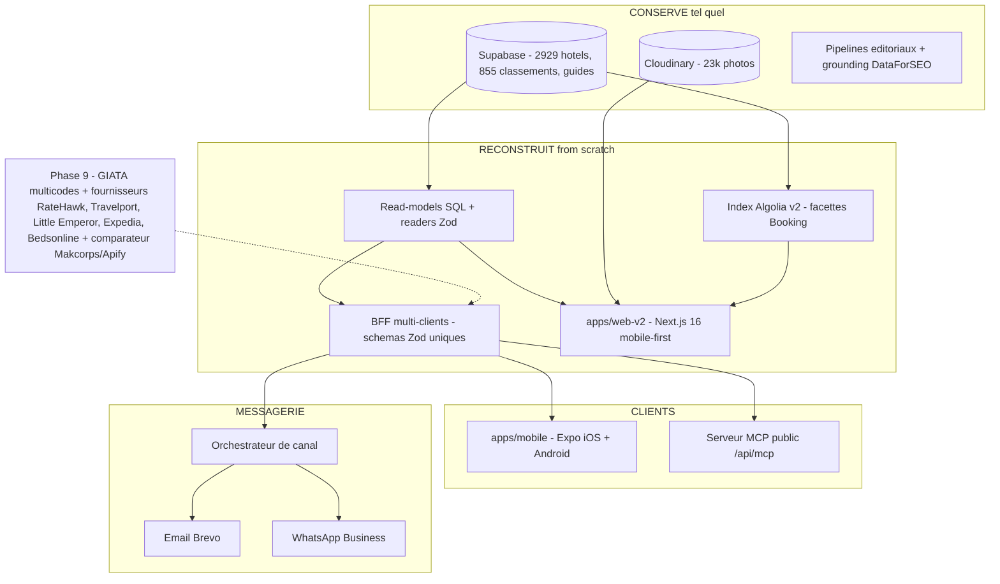
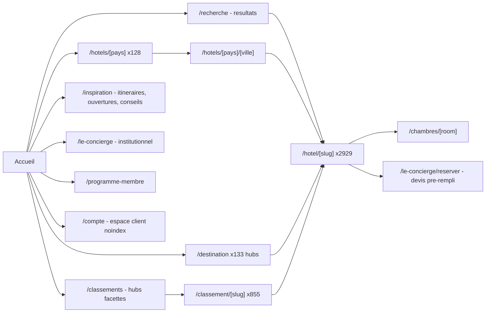

# Cahier des charges — Refonte v2 « Booking-like » MyConciergeHotel.com

> Version 1.0 — 2026-07-03. Consolide le plan d'exécution
> (`.cursor/plans/refonte_booking-like_mch_e9ff4306.plan.md`) et les 42
> décisions PO enregistrées le 2026-07-03. Ce document est la référence
> contractuelle du projet ; le plan WBS reste la référence d'exécution.

---

## 1. Contexte et vision

MyConciergeHotel.com (MCH) est une OTA accréditée IATA spécialisée dans
l'hôtellerie d'exception : 2 929 hôtels publiés dans 128 pays (Palaces,
Relais & Châteaux, Forbes, Michelin Keys, LHW…), 855 classements éditoriaux,
~133 hubs destinations et guides, ~1 147 lieux à visiter, ~23 000 photos
Cloudinary. Tout le contenu vit dans Supabase, indépendant du front.

**Vision v2** : offrir le parcours utilisateur que des millions de voyageurs
connaissent par cœur — celui de Booking.com — en conservant l'identité de
luxe MCH et la profondeur éditoriale qui la différencie. La refonte
reconstruit le front et la couche de lecture from scratch ; la base de
données, les pipelines éditoriaux et les packages durcis sont conservés.

**Un back, quatre surfaces** : la même couche read-models + BFF (schémas Zod
uniques) sert le site web, l'app iOS/Android (Expo), le serveur MCP public
pour les agents IA, et l'orchestrateur de messagerie (email + WhatsApp).

## 2. Objectifs

1. **SEO/GEO classements** : dominer « hôtel de luxe {ville} » (intention à
   plus fort volume, 10-30× « meilleurs hôtels ») et « meilleurs hôtels
   {ville} » — battre yonder.fr et travellers-society.com.
2. **SEO/GEO fiche hôtel** : capter les requêtes navigationnelles (nom
   d'hôtel + variantes) et combinées (« {hôtel} spa/prix/avis »).
3. **UX Booking.com** : parité stricte de structure et d'interactions —
   home → recherche → résultats → fiche → demande, sans réapprentissage.
4. **Contenu enrichi maximal** par page : la couche éditoriale MCH (long-read,
   Conseil du Concierge, FAQ ancrées sur la demande réelle) s'insère sous les
   blocs canoniques Booking.
5. **Conversion membre** : un programme gratuit à 3 niveaux (modèle Booking
   Genius) avec, en fin de projet, un double prix public/membre et un
   comparateur intégré prouvant que le prix membre MCH bat Booking et Expedia.

Baseline de mesure capturée avant tout changement (tâche 0.7) : GSC, GA4,
positions DataForSEO sur 50 requêtes témoins, Web Vitals v1.

## 3. Périmètre

### Inclus

- **Annuaire de recherche** clone structurel Booking : recherche
  destination/dates/occupants, page résultats (filtres, tri, carte,
  pagination), pages pays/ville filtrables et indexables.
- **Fiche hôtel** clone structurel Booking (ancres, mosaïque, box sticky,
  tableau chambres, équipements, conditions, avis, environs) + couche
  éditoriale MCH complète.
- **Éditorial** porté en v2 : classements, hubs de facettes, destinations et
  guides, itinéraires, lieux à visiter, ouvertures récentes,
  conseil-du-concierge.
- **Compte client au standard Booking** (hub à tuiles, voyages, listes de
  favoris nommées, profil + voyageurs, préférences de notification,
  sécurité, confidentialité RGPD).
- **Programme membre gratuit 3 niveaux** Base / Gold / Platinum + interface
  d'acquisition sur tout le parcours + page `/programme-membre`.
- **Dispositif prix** : PriceSlot (mode concierge → mode live), double prix
  public/membre, comparateur intégré MCH vs Booking/Expedia/site officiel.
- **App iOS + Android** (Expo, monorepo, universal links 1:1 avec le web).
- **Serveur MCP public** `/api/mcp` (tools search/get/quote sur les mêmes
  schémas que le BFF).
- **Conciergerie WhatsApp Business** : confirmation double canal
  (email + WhatsApp), parcours proactif J-7 → J+7, moteur de demandes de
  services (transfert, greeter, activités, restaurants, late check-out, spa)
  avec machine à états.
- **Ancrage DataForSEO systématique** de tout contenu (mots-clés, PAA,
  audit de couverture bloquant).

### Exclu / différé

- **Le Concierge Club** (pages marketing) : abandonné — aucun membre inscrit.
  Dépublication + 301. Le compte porte désormais l'avantage membre.
- **Réservation en ligne, prix live, paiement** : Phase 9 uniquement (GIATA +
  multi-fournisseurs — RateHawk, Travelport, Little Emperor, Expedia,
  Bedsonline — dernière brique, décision Q43). Aucun `Offer` JSON-LD, aucun
  indicateur d'urgence avant.
- **Comparateur de prix** : activable en Phase 9 uniquement (il faut un prix
  MCH réel). Emplacement réservé dès la Phase 1.
- Moyens de paiement enregistrés, avis post-séjour, historique de
  transactions dans le compte : Phase 9.
- DE/ES/IT : après la bascule (fr + en au lancement, décision Q27).
- Sourcing d'extraits d'avis / sous-notes : hors périmètre v2 (note agrégée
  Google + attribution uniquement, décision Q19).

## 4. Décisions structurantes (log Q1-Q44, PO 2026-07-03 / 2026-07-07)

### Gouvernance

| #   | Décision                                                                                                                                                                                   |
| --- | ------------------------------------------------------------------------------------------------------------------------------------------------------------------------------------------ |
| Q1  | Budget API+LLM : 500 €/mois en autonomie, plafond dur 1 000 €, run > 300 € chiffré à l'avance                                                                                              |
| Q2  | Validation PO silencieuse 48 h → l'IA continue les tâches indépendantes, re-notifie, jamais d'auto-approbation sur : migration prod, run catalogue entier, soumission externe, bascule DNS |
| Q3  | Reporting par jalon de phase (~10 rapports) + alerte immédiate si blocage                                                                                                                  |
| Q4  | Parallélisation autorisée entre phases indépendantes                                                                                                                                       |
| Q5  | Tâche 0.7 baseline (GSC/GA4/50 requêtes/Web Vitals) avant tout changement                                                                                                                  |
| Q6  | Aucune fenêtre de gel — bascule dès que les gates passent (mardi/mercredi)                                                                                                                 |
| Q7  | Jalon validé = go implicite phase suivante                                                                                                                                                 |

### Technique

| #   | Décision                                                                                                               |
| --- | ---------------------------------------------------------------------------------------------------------------------- |
| Q8  | Vues read-only directement en prod ; nouvelle table = dry-run + validation                                             |
| Q9  | Pages ville indexables, états filtrés noindex/canonical (ADR d)                                                        |
| Q10 | Title classements : « hôtel de luxe {ville} » primaire, « meilleurs hôtels » secondaire, validé par DataForSEO (ADR e) |
| Q11 | Audit `rooms` Phase 0 ; si faible : tableau optionnel assumé, enrichissement post-bascule                              |
| Q12 | Filtre budget = tiers indicatif `luxury_tier`, libellé honnête                                                         |
| Q13 | Dates/occupants = contexte transporté jusqu'au devis, jamais de simulation de dispo                                    |
| Q14 | Nouveau projet Vercel dédié v2, bascule par re-pointage domaine                                                        |
| Q15 | Audit quota Algolia en Phase 0                                                                                         |
| Q16 | `apps/web` gelée (correctifs critiques seuls) — rule `v2-migration-freeze`                                             |
| Q17 | Pipelines éditoriaux continuent pendant la construction                                                                |
| C1a | Note UI /10 + libellé (conversion ×2 depuis /5), JSON-LD reste /5                                                      |

### Produit

| #   | Décision                                                                                                                                                                                                                                                                                                                     |
| --- | ---------------------------------------------------------------------------------------------------------------------------------------------------------------------------------------------------------------------------------------------------------------------------------------------------------------------------- |
| Q18 | Club abandonné (0 inscrit) → 301 ; itinéraires, lieux, ouvertures, conseil-du-concierge conservés                                                                                                                                                                                                                            |
| Q19 | Avis V1 : note agrégée Google /10 + attribution, rien de fabriqué                                                                                                                                                                                                                                                            |
| Q20 | Compte client au standard Booking.com (révisé — voir §10)                                                                                                                                                                                                                                                                    |
| Q21 | Newsletter conservée (Brevo)                                                                                                                                                                                                                                                                                                 |
| Q22 | Formulaire de devis pré-rempli (hôtel, dates, occupants)                                                                                                                                                                                                                                                                     |
| Q38 | Adhésion gratuite = créer un compte (modèle Genius)                                                                                                                                                                                                                                                                          |
| Q39 | Double prix public/membre en Phase 9 ; avant : teasing sans prix fabriqué                                                                                                                                                                                                                                                    |
| Q40 | Avantages membres depuis `hotel_member_benefits` + génériques, « selon disponibilité » explicite                                                                                                                                                                                                                             |
| Q41 | 3 niveaux Base/Gold/Platinum — **détail des programmes différé (PO), construction paramétrable**, placeholder Genius                                                                                                                                                                                                         |
| Q42 | Comparateur de prix intégré : MCH membre / MCH public / Booking / Expedia / site officiel (Phase 9)                                                                                                                                                                                                                          |
| Q43 | Stack de réservation : **GIATA (multicodes)** comme couche de mapping + connecteurs multi-fournisseurs (RateHawk, Travelport, Little Emperor, Expedia, Bedsonline) + agrégateur de tarifs (meilleure offre). **Amadeus abandonné.** Le mapping GIATA peut être backfillé avant la Phase 9                                    |
| Q44 | **Même monorepo + même Supabase** (pas de nouveau repo ni de nouvelle base) — isolation par : nouveau projet Vercel (Q14), schéma SQL `v2` dédié pour toutes les nouvelles tables/vues, gel de `apps/web` (Q16). Rationale : base vivante (pipelines Q17), comptes Auth non migrés, packages durcis partagés sans divergence |

### Client / opérations

| #   | Décision                                                  |
| --- | --------------------------------------------------------- |
| Q23 | Devis : « réponse sous 24 h ouvrées »                     |
| Q24 | Volume < 20/sem → inbox email structurée en V1            |
| Q25 | Escalade WhatsApp → PO (adresse/horaires avant 8b.7)      |
| Q26 | PO valide les brouillons légaux                           |
| Q27 | fr + en au lancement                                      |
| Q28 | WhatsApp : vouvoiement, signature « Votre Concierge MCH » |
| D2  | Fulfillment services V1 : inbox ops interne               |

### Design

| #   | Décision                                                                                |
| --- | --------------------------------------------------------------------------------------- |
| Q29 | Loi d'arbitrage : structure = Booking sans exception ; surface = MCH ; lisibilité prime |
| Q30 | Icônes Lucide                                                                           |
| Q31 | Audit licences fontes app native en Phase 0                                             |
| Q32 | Assets stores produits par l'IA, validation PO                                          |
| Q33 | Crops vignettes Cloudinary `c_fill,g_auto` ; < 5 photos → mosaïque dégradée             |
| Q34 | Pas de dark mode web ; app en V1.1                                                      |
| E1  | Maquettes = prototypes codés navigateur, pas de Figma                                   |

### Différées (avec échéance)

- **Q41** — détail des niveaux membres : avant le dev de 4.3bis (Phase 4).
- **Q35** — Meta Business + numéro WhatsApp : ~2 sem. avant 8b.1.
- **Q36** — Apple Developer + Play Console : avant Phase 8.
- **Q37** — provider WhatsApp : analyse IA en 8b.1.
- **Q43-paiement** — choix du PSP (Stripe / Adyen / autre) et modèle marchand
  pour les fournisseurs à tarif net (RateHawk, Bedsonline) : PO + ADR, au plus
  tard au démarrage de la Phase 9.
- **Q43-accès** — accès fournisseurs : **API de test uniquement** à ce jour
  (sandbox GIATA + fournisseurs). Développement et recette Phase 9 en sandbox ;
  passage des contrats en live = handoff PO avant la mise en production.
- **Baseline 0.7** — accès GSC + GA4 confirmés, fournis par le PO au démarrage
  de la Phase 0.

## 5. Architecture technique

- **Monorepo pnpm + Turborepo**, TypeScript strict (zéro `any`/`as`/`!`).
- **apps/web-v2** : Next.js 16, Tailwind v4, i18n fr/en, CSP nonce +
  rendu dynamique (ADR-0031), Sentry.
- **packages/ui-v2** : design system Booking-like (~18 composants), tokens
  partagés web + mobile (module TS + CSS vars).
- **Read-models** : `hotel_card_v2`, `hotel_detail_v2`, agrégats de facettes
  par ville, `ranking_card_v2`, `guide_card_v2`, `hotel_keywords_v2`,
  `destination_keywords_v2`, `member_status` — latence < 200 ms p95.
- **Conservés** : `packages/config`, `packages/integrations`, `packages/seo`
  (builders JSON-LD), `packages/domain`, pipelines éditoriaux (gates
  anti-leak, grounding).

## 6. Organigramme du site et contenu de chaque page

### 6.1 Header (2 rangées, pattern Booking)

**Rangée 1 — utilitaires** : logo → `/` · sélecteur FR/EN · Aide
(`/le-concierge/faq`) · « Pour les hôteliers » · Connexion / Mon compte
(+ badge de niveau membre pour les connectés).

**Rangée 2 — onglets de section** : **Hôtels** (défaut) · **Destinations** ·
**Classements** · **Inspiration** · **Le Concierge**.

**Bloc de recherche** (destination + dates + occupants) : héro pleine largeur
sur la home, compacté et modifiable sur toutes les autres pages. Jamais caché.

### 6.2 Arbre complet

### 6.3 Description page par page

#### Accueil `/`

1. Header 2 rangées + **bloc recherche héro** (SearchBar, DateRangePicker
   double mois, OccupancySelector).
2. Bandeau membre « Devenez membre, économisez jusqu'à 25 % » (non connectés).
3. Rangées scrollables horizontales (pattern Booking exact) :
   « Destinations populaires » (villes par nombre d'hôtels, compteurs réels) ·
   « Explorez la France » (régions) · « Par type d'hébergement » (12 types) ·
   « Marques emblématiques » (18+) · « Inspiration / Classements » (curation).
4. « Vos recherches récentes » + « Encore intéressé ? » (consultés récemment).
5. Footer longue traîne (voir 6.4).

#### Page résultats `/recherche` (SRP)

1. Barre de recherche modifiable en haut (sticky).
2. **Sidebar filtres** (ordre Booking) : budget indicatif (tiers
   `luxury_tier`), filtres populaires, étoiles, note des clients,
   équipements (~25-30 facettes normalisées), quartier. Compteurs de
   facettes recalculés à chaque filtre. Mobile : bottom sheet plein écran
   avec compteur live.
3. Barre de tri + encart « Afficher sur la carte » (Mapbox, clustering,
   synchronisation carte ↔ filtres).
4. **ResultCards** denses : photo (vignette carrée) | contenu (nom, étoiles,
   quartier + distance, points forts, badge éditorial) | note /10 + libellé
   - **PriceSlot** (mode concierge : « Prix via le Concierge » + badge
     membre -25 %). Cœur favori sur chaque card.
5. Pagination. États filtrés en noindex.

#### Pages annuaire `/hotels`, `/hotels/[pays]` (×128), `/hotels/[pays]/[ville]`

- **Pays** : intro éditoriale, villes du pays, top hôtels, maillage vers
  classements/guides du pays.
- **Ville** : même gabarit que la SRP pré-filtrée sur la géographie +
  H1/intro éditoriale unique + liens vers le classement et le guide de la
  ville. **Canonique et indexable** (Q9), états filtrés en noindex.

#### Fiche hôtel `/hotel/[slug]` (×2 929) — le gabarit central

Blocs canoniques (structure Booking stricte), dans l'ordre :

1. **Header** : H1 (title/H1/meta construits sur les mots-clés DataForSEO de
   la fiche), étoiles, badges labels (R&C, Palace…), adresse cliquable,
   breadcrumb Accueil → Pays → Ville → Fiche, partage/favori.
2. **Ancres sticky** : Aperçu | Infos & tarifs | Équipements | Conditions |
   Avis (scroll-spy).
3. **Mosaïque 5 photos** (1 grande + 4) → galerie plein écran par catégories,
   swipe mobile. Alt enrichis.
4. **Colonne droite sticky** : note /10 + libellé, carte miniature, points
   forts, **bloc avantages membres**, **PriceSlot** (« Prix via le
   Concierge » + CTA devis pré-rempli — Phase 9 : prix public + prix membre
   - **comparateur** MCH membre/MCH public/Booking/Expedia/site officiel).
     Mobile : barre de réservation fixe en bas.
5. **Tableau des chambres** : type, occupants (icônes), taille, lits,
   conditions, colonne PriceSlot ; lien sous-pages
   `/hotel/[slug]/chambres/[room]` (canonical strict). Bloc dégradé propre
   si pas de chambres structurées.
6. **Équipements** : AmenityGrid par catégories, facettes normalisées, les
   plus populaires en tête.
7. **Avis** : badge /10 + libellé + « Note Google, N avis » — attribution
   visible, rien de fabriqué.
8. **« À savoir »** : HouseRulesTable depuis `policies` (check-in/out,
   enfants, animaux, annulation, paiement).
9. **Environs** : carte quartier + POI à proximité (distances), maillage
   vers `/lieux`.

Couche éditoriale MCH (sous les blocs canoniques, section Aperçu étendue) :

10. **Sections long-read** (6-8 par fiche, ~3 000-4 000 mots, TOC).
11. **⭐ Le Conseil du Concierge** (le différenciateur).
12. **FAQ** ≥ 10 — questions = PAA DataForSEO réels, réponses réintègrent
    les mots-clés (entité + mot-clé dans les 2 premières phrases). Gate de
    couverture bloquant.
13. Classements où figure l'hôtel + teaser guide destination (maillage).
14. Sources EEAT (faits vérifiés + références externes).

JSON-LD : Hotel (+containedInPlace), BreadcrumbList, FAQPage, ImageObject[],
AggregateRating (/5), Review[], Award[] — **sans Offer** avant la Phase 9.

#### Classement `/classement/[slug]` (×855)

Long-read : title/H1 « hôtel de luxe {ville} » primaire (Q10, DFS-grounded),
TOC sticky, **entrées en cards riches** (photo, note /10, points forts
concrets, PriceSlot, CTA fiche), sections éditoriales, FAQ PAA, sources.
JSON-LD ItemList + FAQPage. Hubs de facettes `/classements/[axe]/[valeur]`
(lieu 172, type 12, thème 20, occasion 9, saison 4) avec maillage vers la
SRP pré-filtrée.

#### Destination `/destination/[slug]` (~133) et guides `/guide/[pays]`

Hub ville : teaser SRP (top hôtels) + guide long-read inliné (ADR-0015),
FAQ destination ancrée sur les seeds DataForSEO (« où dormir à {ville} »,
« que faire {ville} »), maillage bidirectionnel fiche ↔ ville ↔ classement
↔ guide. Guides standalone pour régions/clusters/pays.

#### Inspiration

Itinéraires (`/itineraires`, ×23), Ouvertures récentes (`/ouvertures`),
Le Conseil du Concierge (`/le-conseil-du-concierge`), Lieux à visiter
(`/lieux`, ~1 147 POI) — tous conservés et portés en v2 (Q18).

#### Programme membre `/programme-membre`

Page indexable, l'équivalent de la page Genius : tableau comparatif des 3
niveaux (rendu depuis la config de programme), règles de progression
transparentes, FAQ du programme. Liée depuis header, footer et bandeaux.

#### Espace compte `/compte/*` (noindex)

Voir §10. Hub à tuiles : Mon statut membre (niveau + barre de progression),
Mes voyages, Mes listes, Mes demandes, Informations personnelles,
Préférences, Sécurité, Confidentialité.

#### Le Concierge (institutionnel)

À propos, Méthode éditoriale, FAQ, Pour les hôteliers, MICE, Presse,
Réserver via le Concierge (formulaire de devis). Le Concierge Club : 301.

### 6.4 Footer (longue traîne, pattern Booking)

- **Explorer** : Recherche · Destinations · Tous les hôtels · Annuaire
  France · Classements · Lieux à visiter.
- **Top destinations** : 8 villes FR + 8 monde + 8 régions.
- **Catalogue** : 12 types · marques · 9 distinctions · top classements.
- **Services** : Mon compte · Programme membre · Aide · Réserver via le
  Concierge · Newsletter.
- **Légal & agents** : mentions légales · confidentialité · CGV · cookies ·
  `sitemap.xml` · `llms.txt` · `agent-skills.json`.

## 7. Dispositif prix (PriceSlot → membre → comparateur)

Trois étages, un seul composant contractuel (`PriceSlot`) :

1. **Mode `concierge` (v2, avant APIs)** : « Prix via le Concierge » + CTA
   devis pré-rempli + badge « Les membres économisent jusqu'à 25 % ».
   **Jamais de prix fabriqué** (DGCCRF).
2. **Mode `live` (Phase 9)** : prix public TTC (toujours visible — contrainte
   SEA ADR-0020) + **prix membre** plafonné par niveau, verrouillé avec
   cadenas pour les non-connectés (« Connectez-vous pour débloquer »),
   déverrouillé et mis en avant pour les connectés.
3. **Comparateur intégré (Phase 9, Q42)** : tableau compact sous le prix —
   **MCH membre (en tête) / MCH public / Booking.com / Expedia / site
   officiel** — mêmes dates/occupation/type de chambre, TTC, horodaté
   (« prix constatés le {date} »). Sourcing Makcorps + Apify (non affilié),
   cache Redis TTL ≤ 6 h, chargement différé (LCP intact). Règles dures :
   correspondance stricte des conditions, ligne masquée si source
   indisponible (jamais estimée), écarts défavorables affichés aussi
   (crédibilité + publicité comparative L122-1).

## 8. Programme membre (gratuit, 3 niveaux)

- **Adhérer = créer un compte** (Q38, modèle Genius, zéro friction).
- **3 niveaux : Base → Gold → Platinum** (Q41). Progression par séjours
  confirmés via MCH (comptage ops aujourd'hui, automatique via les
  réservations fournisseurs en Phase 9).
- **Le détail des niveaux (seuils, remises, avantages) sera défini par le PO**
  avant le développement de l'interface (Phase 4). Tout est construit
  **paramétrable** : config de programme validée Zod (donnée, pas code),
  `computeMemberTier(stays, config, clock)` pur et testé, UI rendue depuis
  la config. Placeholder de développement : -10/-15/-25 %, 3/8 séjours,
  fenêtre 2 ans — non contractuel.
- **Interface d'envie** (4.3bis) : bandeaux d'acquisition (home, fiche),
  badge sur les cards, bloc avantages dans la box sticky, avantages du
  niveau supérieur grisés (« Débloqué au niveau Gold »), barre de
  progression dans le compte, notification au passage de niveau, écran de
  bienvenue post-inscription.

## 9. SEO / GEO — ancrage DataForSEO (exigence transverse)

### 9.0 Modèle de ciblage requêtes par gabarit (PO 2026-07-07 — ADR-0034)

Chaque gabarit possède **une famille de requêtes exclusive** — contrat
anti-cannibalisation du site. Aucun gabarit ne cible la famille d'un autre.

| Gabarit                                                  | Famille de requêtes                                                                                        |
| -------------------------------------------------------- | ---------------------------------------------------------------------------------------------------------- |
| **Fiche hôtel** `/hotel/[slug]`                          | `Hôtel {Nom}` · `Hôtel {Nom} tarif` · `Hôtel {Nom} promo`                                                  |
| **Annuaire** `/hotels/[pays]` et `/hotels/[pays]/[zone]` | `Hôtel {Pays}` · `Hôtel {Ville}` · `Hôtel {Région}`                                                        |
| **Classement** `/classement/[slug]`                      | `Meilleur hôtel de luxe à {Ville}` · `Meilleur hôtel 5 étoiles en {Pays}` · `Les plus beaux hôtels {Pays}` |

Conséquences : (a) la fiche porte des sections ancrées `#tarifs` et `#promos`
obligatoires ; (b) le segment 2 de l'annuaire accepte ville OU région ;
(c) le lexique superlatif (« meilleur », « plus beaux ») est réservé aux
classements ; (d) `/destination/*` garde l'informationnel (guides, que
faire) et renvoie l'intention hôtelière vers l'annuaire. Templates
title/H1/meta centralisés dans
`apps/web-v2/src/lib/seo/keyword-templates.ts` — source de vérité unique.

Chaque fiche et chaque destination est ancrée sur la demande réelle :

1. **Mots-clés par hôtel** (navigationnels + combinés, volume + intention,
   DataForSEO Labs) stockés en read-model `hotel_keywords_v2`.
2. **Questions clients (PAA)** par hôtel et destination → matière première
   des FAQ ; bruit filtré, jamais forcé.
3. **Title + H1 + meta + contenu couvrent les mots-clés** — audit de
   couverture automatisé par page, seuil bloquant, régénération ciblée
   sous le seuil.
4. **Mots-clés dans les FAQ, questions ET réponses** — gate
   `dfs_paa_coverage` promu bloquant.
5. **Destinations et classements** : seeds « hôtel de luxe {ville} »,
   « meilleurs hôtels {ville} », « où dormir à {ville} », « que faire ».

Garde-fous SEO de la bascule : conservation des URLs du cœur de catalogue
(zéro 301 sur `/hotel/*`, `/classement/*`, `/destination/*`), diff de
contenu v1 ↔ v2 automatisé, crawl complet pré-bascule, rollback < 15 min.
Dégradation propre si DataForSEO indisponible (`grounding=off` tracé).

## 10. Compte client (standard Booking)

- **Hub à tuiles** `/compte` : statut membre, voyages, listes, demandes,
  profil, préférences, sécurité, confidentialité.
- **Mes voyages** : chronologie à venir/passés — demandes de devis et de
  services avec statuts (pré-Phase 9), réservations fournisseurs ensuite.
- **Mes listes** : favoris multiples nommés, partage lecture seule, toast
  « Enregistré dans {liste} ».
- **Profil** : identité, téléphone E.164 (réutilisé par l'opt-in WhatsApp),
  voyageurs enregistrés (pré-remplissage devis).
- **Préférences** : langue, devise (informatif), centre de notifications
  par canal × type (email, newsletter, WhatsApp — UI du consentement).
- **Sécurité / Confidentialité** : mot de passe, sessions actives,
  export RGPD, suppression en cascade.
- Supabase Auth conservé — les identifiants existants fonctionnent tels
  quels, favoris migrés vers une liste par défaut, zéro perte.
- Tables : `favorite_lists(+items)`, `saved_travellers`,
  `notification_preferences`, `recently_viewed`, `member_status` — RLS par
  `user_id`, testée par rôle.

## 11. Conciergerie WhatsApp Business + moteur de services

- **Double canal** : réservation confirmée → email Brevo (toujours) +
  WhatsApp (si opt-in) en < 2 min. Opt-in explicite RGPD au booking,
  `STOP` fr/en coupe tout, numéros jamais loggés.
- **Parcours proactif** : J-7 (transfert + restaurants depuis les F&B/POI de
  la fiche), J-1 (greeter, early check-in), arrivée, mi-séjour, veille du
  départ (late check-out), J+1, J+7 (marketing, opt-in séparé). Caps :
  ≤ 1 proactif/jour, ≤ 6 touchpoints/séjour. Templates HSM fr/en approuvés
  Meta, voix Concierge, vouvoiement.
- **Moteur de demandes de services** : 8 types (transfert, greeter,
  activité, restaurant, late checkout, early checkin, spa, demande
  spéciale), machine à états `requested → forwarded → confirmed | declined
| cancelled` (domaine pur), fulfillment V1 = inbox ops interne, suivi
  dans `/compte` et back-office.
- **Inbound LLM** : classification d'intention dans la fenêtre 24 h,
  réponses ancrées sur les données de la fiche, **zéro invention de
  prix/dispo** (« demande transmise, confirmation sous X h »), escalade
  humaine : paiement, réclamation, médical, incertitude.

## 12. App mobile + serveur MCP

- **App Expo** (`apps/mobile`) : mêmes tokens, consommation BFF, routes
  miroir des URLs web, universal links, écrans V1 = recherche, fiche,
  destinations, classements, compte membre, devis. Offline favoris, Sentry
  RN, privacy manifest / Data Safety, EAS build + stores.
- **MCP public** (`/api/mcp`) : tools `search_hotels`, `get_hotel`,
  `get_ranking`, `get_guide`, `get_hotel_sources`, `request_quote` —
  adaptateurs minces sur les fonctions domaine du BFF, mêmes schémas Zod,
  rate limiting, sync `llms.txt` + `agent-skills.json`.

## 13. Exigences non fonctionnelles

- **Performance** : LCP ≤ 2,5 s mobile milieu de gamme, INP < 200 ms,
  CLS < 0,1, first-load JS < 180 KB gzip (routes marketing), Lighthouse
  mobile ≥ 85 sur les 4 gabarits.
- **Mobile-first** : chaque gabarit maquetté et développé mobile d'abord ;
  touch targets ≥ 44 px ; un gabarit validé desktop-only est refusé.
- **Accessibilité** : WCAG 2.2 AA, axe-core sans violation, navigation
  clavier complète (picker, filtres, galerie), contraste AA sur la palette.
- **Sécurité** : CSP nonce stricte, secrets via `@mch/config/env`, rate
  limiting Upstash, RLS Supabase, zéro PII dans les logs, webhooks signés.
- **RGPD** : consentement par canal, export, effacement en cascade
  (y compris conversations WhatsApp).
- **Éthique d'affichage** : aucun compteur d'urgence ni prix barré
  artificiel sans donnée réelle (CDC §2.8 / DSA art. 25) ; prix toujours
  TTC en euros ; comparateur exact ou masqué.

## 14. Phasage et jalons

| Phase | Contenu                                                                                                                                                                                                                                                        | Durée                |
| ----- | -------------------------------------------------------------------------------------------------------------------------------------------------------------------------------------------------------------------------------------------------------------- | -------------------- |
| 0     | Cadrage : matrice de parité Booking, 7 ADRs, gouvernance skills, maquettes codées, mapping URL, setup, baseline                                                                                                                                                | 2 sem.               |
| 1     | Fondations : scaffold web-v2, tokens, design system ui-v2 (~18 composants), contrat PriceSlot (+membre +comparateur)                                                                                                                                           | 2 sem.               |
| 2     | Back : read-models, readers Zod, taxonomie équipements, note /10, Algolia v2, BFF, événements réservation, grounding DataForSEO, socle compte/membre                                                                                                           | 3-4 sem.             |
| 3     | Annuaire : home, autocomplete, SRP, carte, pages pays/ville                                                                                                                                                                                                    | 3-4 sem.             |
| 4     | Fiche hôtel + programme membre (4.3bis) + espace compte (4.9bis) + JSON-LD                                                                                                                                                                                     | 5-6 sem.             |
| 5     | Éditorial : classements, hubs, destinations/guides                                                                                                                                                                                                             | 2-3 sem.             |
| 6     | Serveur MCP public                                                                                                                                                                                                                                             | 1-2 sem. (∥ Phase 5) |
| 7     | Audit SEO, run parallèle, bascule production, décommission                                                                                                                                                                                                     | 2 sem.               |
| 8     | App iOS/Android (Expo, EAS, stores)                                                                                                                                                                                                                            | 6-8 sem.             |
| 8bis  | WhatsApp + moteur de services                                                                                                                                                                                                                                  | 5-6 sem. (∥ Phase 8) |
| 9     | APIs réservation : mapping GIATA + connecteurs multi-fournisseurs (RateHawk, Travelport, Little Emperor, Expedia, Bedsonline), agrégateur de tarifs, double prix membre, comparateur, tunnel de paiement (PSP à trancher), messagerie sur réservations réelles | fin de projet        |

Durée web (0-7) ≈ 5-6 mois ; app + WhatsApp en parallèle ensuite.

## 15. Contrôle qualité (gates transverses, appliqués à chaque tâche)

- **QG-1 Code** : lint + typecheck + tests verts, zéro `any`/`as`/`!`,
  layering respecté, nouvelle règle métier = nouveau test.
- **QG-2 Walk-through** : parcours réel navigateur, mobile d'abord puis
  desktop, fr + en, captures, découvrabilité ≤ 2 clics, assertions sur les
  valeurs rendues.
- **QG-3 SEO/GEO** : canonical/hreflang, JSON-LD validé, parité note
  UI ↔ markup, diff de contenu vs v1, couverture DataForSEO ≥ seuil.
- **QG-4 Performance** : budgets LCP/JS/CLS ci-dessus.
- **QG-5 Données** : échantillons contrôlés contre la base, zéro leak de
  scaffolding, dégradation propre sans 500.

## 16. Risques principaux

1. **SEO** : perte de blocs éditoriaux ou d'URLs à la bascule → diff
   automatisé + mapping URL exhaustif + rollback < 15 min.
2. **Drift multi-clients** (web/app/MCP) → un schéma Zod par capacité,
   logique uniquement dans le domaine.
3. **Comparateur** : prix faux/périmé = publicité trompeuse → TTL court,
   horodatage, masquage propre ; scraping instable → couche optionnelle.
4. **WhatsApp quality rating** Meta → opt-in strict, caps, alerte
   observabilité, templates soumis ≥ 1 sem. avant release.
5. **Promesses automatiques** (services, prix membre) → wording « selon
   disponibilité » / « jusqu'à », jamais de confirmation sans humain/API.
6. **Effet tunnel** → bascule surface par surface en preview, walk-through
   par phase, baseline 0.7 comme juge de paix.
