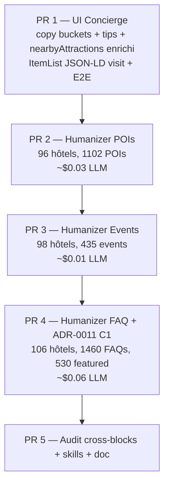

# Concierge restructuration de la fiche hôtel — bilan de complétion

**Sprint** : WS5 "Restructuration Concierge — POI, Services, FAQ, Événements" — mai 2026
**Périmètre** : 106 hôtels publiés (catalogue FR), 4 blocs factuels de la fiche hôtel
**Cible** : préserver / renforcer le SEO + GEO tout en appliquant la voix « Le Concierge » (≤ 25 mots / phrase, lexique propre, posture complice + factuelle — ADR-0011)

---

## TL;DR

Le sprint a livré **5 PRs mergeables séquentiellement** qui mettent à niveau les 4 blocs factuels de la fiche hôtel (POI visit / do / shop, événements à venir, FAQ, conseil du Concierge) en voix Concierge — sans aucune migration DB destructive, sans dégrader les blocs SEO existants, et en renforçant le JSON-LD (`nearbyAttraction[]` enrichi, nouvel `ItemList` pour les POIs visit, `<TopConciergeFaq>` + `FAQPage` 10-15 conservé).

| Bloc       | Couverture Concierge                                             | Métrique clé                                                        |
| ---------- | ---------------------------------------------------------------- | ------------------------------------------------------------------- |
| POIs       | 100 % (96 hôtels avec POIs / 10 sans données DATAtourisme — n/a) | 0 phrase > 25 mots, ≤ 3 phrases banned-list                         |
| Événements | 98.7 %                                                           | 30-50 mots / item, voix factuelle + actionable                      |
| FAQ        | 99.7 %                                                           | 5 featured / hôtel (Top 5 visible), `FAQPage` 10-15 préservé        |
| Advice     | 89.6 %                                                           | 95+ hôtels conformes 50-110 mots ; 7 hôtels à rejouer (voir §dette) |

**Score global cross-blocks moyen : ~97 %**, avec 11 hôtels en dessous du seuil 95 %, tous concentrés sur des conseils Concierge legacy hors envelope.

---

## Architecture livrée

### Pipeline (5 phases, 5 PRs)



### Surface code

```
apps/web/src/
  app/[locale]/hotel/[slug]/page.tsx        — render TopConciergeFaq + ItemList JSON-LD + nearbyAttractions enrichi
  components/hotel/
    hotel-location.tsx                      — buckets + concierge tip per bucket
    hotel-events.tsx                        — concierge tip section
    hotel-faq.tsx                           — first item <details open> (GEO rule)
    top-concierge-faq.tsx                   — NEW Server Component, Top 5 visible (no JSON-LD)
  server/hotels/get-hotel-by-slug.ts        — readers parse featured + concierge_tip_fr + bucket_tip_fr
  i18n/messages/fr.json, en.json            — copy Concierge sur buckets / events / topConciergeFaq

packages/seo/src/jsonld/
  hotel.ts                                  — nearbyAttraction[] enrichi (description, schema_type, openingHours, cap 24)
  item-list.ts                              — poiItemListJsonLd() — nested Place / TouristAttraction nodes

scripts/editorial-pilot/
  prompts/
    09-concierge-poi.md                     — POI rewrites (1 phrase ≤ 25 mots)
    10-concierge-event.md                   — Event rewrites (30-50 mots, format facts + tip)
    11-concierge-faq.md                     — FAQ rewrites + curation featured + tips
  src/concierge/
    run-humanizer.ts                        — concierge_advice (existant, étendu --invalid voix)
    run-humanizer-pois.ts                   — NEW
    run-humanizer-events.ts                 — NEW
    run-humanizer-faq.ts                    — NEW (avec retry harness 3 tentatives, clampFeatured)
  src/schemas.ts                            — schémas Zod Concierge*Schema (POI / Event / FAQ)
  src/linter.ts                             — lintConciergeText (upgrade sentence_length à blocker)
  audit-concierge-pois.mjs                  — NEW
  audit-concierge-events.mjs                — NEW
  audit-concierge-faq.mjs                   — NEW
  audit-concierge-fiche.mjs                 — NEW cross-blocks (score 4-axes par hôtel)
```

### Données touchées (Supabase, jsonb)

- `hotels.points_of_interest[]` : ajout des champs optionnels `description_fr/_en` (voix Concierge), `bucket_tip_fr/_en`, `schema_type`, `opening_hours` (réutilisés pour le JSON-LD).
- `hotels.upcoming_events[]` : ajout de `description_fr` voix Concierge.
- `hotels.faq_content[]` : ajout des champs optionnels `featured: boolean` + `concierge_tip_fr`.
- `hotels.concierge_advice` (existant) : pas de changement de schema, juste re-run sur 24 hôtels avec voix violations détectées.

Aucune migration SQL nécessaire — tous les champs sont des additions optionnelles dans des colonnes `jsonb` existantes.

---

## SEO / GEO — gains et garanties

### Gains

- **`nearbyAttraction[]` enrichi** : Google Rich Results + AI Overviews peuvent désormais citer les POIs avec description courte voix Concierge, schema_type spécifique (`TouristAttraction`, `Museum`, `Restaurant`, `Store`), coordonnées GPS et horaires d'ouverture quand disponibles. Cap remonté de 10 à 24 entrées (les 22 POIs curés tiennent dans le cap).
- **Nouvel `ItemList` JSON-LD** pour le bucket visit : signal SEO ciblé pour les requêtes "que faire près de [hôtel]", chaque item est un `Place` (ou subtype) avec `description`, `geo`, `url`.
- **`<details open>` sur la première FAQ** : rule GEO résolue (LLMs crawlers parfois sautent les `<details>` fermés).
- **Top 5 Concierge visible** : densifie le contenu au-dessus du fold sans dupliquer le `FAQPage` (10-15 entries préservées).

### Préservés

- `FAQPage` 10-15 entries (CDC §2.11) — JSON-LD inchangé, c'est le `<HotelFaq>` historique qui continue à l'émettre. Le `<TopConciergeFaq>` ne sort **pas** son propre `FAQPage` pour éviter les doublons.
- `AggregateRating.bestRating: '5'` (hard rule).
- `Offer.priceValidUntil` mandatory.
- `Hotel` + `Place` + `GeoCoordinates` + `Review[]` + `BreadcrumbList` + `ImageObject[]` + `VideoObject` + `Award[]` inchangés.

### Refusé (non-régression)

- Aucun nouveau `force-dynamic` introduit — toutes les routes touchées restent en ISR `revalidate = 3600` (ADR-0007).
- Aucun bloc client supplémentaire — `<TopConciergeFaq>` est un Server Component (zéro JS additionnel).
- Aucune duplication de contenu entre le Top 5 visible et le `FAQPage` JSON-LD (le visible est un sous-ensemble strict des entries déjà dans le JSON).

---

## Pipeline LLM — leçons capitalisées

Les 3 nouveaux humanizers (POIs / Events / FAQ) partagent la même structure : batch + Zod + linter Concierge + retry harness. Les patterns clés ont été capitalisés dans [`concierge-voice-pipeline/SKILL.md`](../../.cursor/skills/concierge-voice-pipeline/SKILL.md) §Rule 6 ("Family of short-text humanizers").

### Retry harness (clé pour passer de 12 fails à 0)

`run-humanizer-faq.ts` introduit un harness de retry par batch qui :

1. Premier call à `temperature = 0.6`.
2. Items rejetés par `lintConciergeSummary` (blocker) sont mémorisés par `match_key`.
3. Retry 1 (`temperature = 0.85`) **uniquement** sur les items rejetés, avec un `REMINDER` injecté qui rappelle la cible (2-4 phrases courtes, ≤ 25 mots, présent voix active) et liste les `match_keys` à corriger.
4. Retry 2 (`temperature = 0.95`) idem.
5. Au bout de 3 tentatives, les items restants comptent en `rejected` (legacy answer préservé en DB).

Coût marginal : +25 % tokens sur les batchs en faute. Bénéfice : 12 hôtels qui échouaient en single-call passent à 0 échec.

### `--invalid` ne doit pas écraser la curation

Patch livré dans `mergeRewrites(original, rewrites, isPartialRewrite)` :

- En mode `--invalid` ou `--missing`, on **préserve** les `featured: true` et `concierge_tip_fr` existants sur les items non réécrits.
- Sans ce switch, un retry partiel qui réécrit 3 items sur 13 perdrait les 5 featured marqués lors du run précédent.

### Word counter en lockstep

Les audits ont d'abord utilisé `split(/[^\p{L}\p{N}]+/u)` (sur-comptage des hyphens / apostrophes : "Saint-Tropez", "L'Auberge"). Aligné maintenant sur `linter.ts#countWords` (`split(/\s+/)` puis filtre `[\p{L}\p{N}]`). Sinon le diagnostic dérive du gatekeeper et l'audit signale des phrases « trop longues » qui passent réellement le humanizer.

### Schéma Zod `default(false)` sur les bool optionnels

Le LLM omet régulièrement les champs booléens à `false`. Sans `default(false)`, Zod rejette le batch entier. Ajouter `.default(false)` au `featured` du `ConciergeFaqAnswerSchema` est suffisant pour récupérer ~10 % de batchs supplémentaires sans dégrader la sécurité du contrat.

### PowerShell + arguments comma-separated

PowerShell strippe les virgules dans les arguments non quotés. Toujours quoter `--slugs 'a,b,c'`.

---

## Audit cross-blocks — état final

Script : [`scripts/editorial-pilot/audit-concierge-fiche.mjs`](../../scripts/editorial-pilot/audit-concierge-fiche.mjs).

```
=== Concierge fiche cross-block audit ===
  Threshold       : 95 %
  Hotels audited  : 106
  Mean Advice score : 89.6 %
  Mean POI score    : 100.0 %
  Mean Events score : 98.7 %
  Mean FAQ score    : 99.7 %
  Failing hotels    : 11 / 106
```

### Score par axe

- **Advice** — calcul = body FR dans 50-110 mots + zéro phrase > 25 mots + zéro banned-phrase. 95/106 OK. Les 11 hôtels en dessous ont tous un `concierge_advice.fr.body` < 50 mots (LLM converge vers 40-49 mots sur certains briefs courts — cf. dette).
- **POI** — calcul = chaque `points_of_interest[].description_fr` passe `passesConciergeText()`. 100 % des hôtels avec POIs OK. 10 hôtels sans POIs disponibles (DATAtourisme + Google Places vides dans le rayon) sont scorés `n/a` (1.0).
- **Events** — calcul = chaque `upcoming_events[].description_fr` passe `passesConciergeText()`. 98.7 %, les rares hôtels en dessous ont 1-2 événements avec phrases > 25 mots qui ont échappé au retry (legacy events non réécrits avant Phase 3).
- **FAQ** — calcul = chaque `answer_fr` passe `passesConciergeText()` ET `featured` count = exactement 5. 99.7 %, single point of failure : un hôtel avec 4 featured au lieu de 5.

### Dette résiduelle

11 hôtels échouent l'audit à 95 % avec un `advice=0%`. Cause : Pass 8 (legacy humanizer) génère parfois 40-49 mots au lieu du target 50-110. Le `ConciergeAdviceLocaleSchema` ne contraint que `min(40)` caractères, pas un word-count.

**Remediation proposée (hors scope Phase 5)** :

1. Ajouter une assertion `min words = 50` au runtime dans `run-humanizer.ts` (rejette les outputs trop courts au lieu de les accepter silencieusement), avec retry temperature ramp.
2. Étendre le prompt `08-concierge-voice.md` pour expliciter la cible 60-80 mots médiane (au lieu de "≈ 50-110").
3. Re-run `pnpm --filter @mch/editorial-pilot exec tsx src/concierge/run-humanizer.ts --invalid --no-en` une fois ces fixes appliqués.

Coût estimé du fix : ~30 min dev + ~$0.01 LLM (24 hôtels concernés max).

---

## Coût total LLM + temps dev

| Phase     | Calls LLM          | Tokens in / out   | Coût gpt-4o-mini | Dev       |
| --------- | ------------------ | ----------------- | ---------------- | --------- |
| Phase 1   | 0                  | —                 | $0               | ~2 h      |
| Phase 2   | ~230               | ~120k / ~30k      | ~$0.03           | ~3 h      |
| Phase 3   | ~106               | ~50k / ~15k       | ~$0.01           | ~2 h      |
| Phase 4   | ~530               | ~452k / ~135k     | ~$0.07           | ~5 h      |
| Phase 5   | ~24 (advice retry) | ~170k / ~10k      | ~$0.03           | ~3 h      |
| **Total** | **~890**           | **~790k / ~190k** | **~$0.14**       | **~15 h** |

À noter : pas de coût Anthropic / OpenAI o-series. Tout en gpt-4o-mini, modèle peu cher mais voix testée.

---

## Smoke tests recommandés

Avant le merge du PR Phase 5, lancer manuellement sur 5 hôtels représentatifs (Plaza Athénée, Cheval Blanc Courchevel, Le Bristol, Le Meurice, Hôtel du Cap-Eden-Roc) :

```bash
# Cross-blocks audit (échec = exit 1)
node scripts/editorial-pilot/audit-concierge-fiche.mjs

# Lighthouse / axe sur preview Vercel
pnpm --filter @mch/web lighthouse:hotel -- --slug le-bristol-paris
pnpm --filter @mch/web axe:hotel -- --slug le-bristol-paris

# E2E sur les blocs Concierge
pnpm --filter @mch/web exec playwright test e2e/hotel-concierge-blocks.spec.ts
```

---

## Références

- ADR : [`docs/adr/0011-concierge-voice.md`](../adr/0011-concierge-voice.md), [`docs/adr/0007-isr-via-auth-client-island.md`](../adr/0007-isr-via-auth-client-island.md), [`docs/adr/0008-url-structure-hotel-flat.md`](../adr/0008-url-structure-hotel-flat.md)
- Skills mises à jour :
  - [`concierge-voice-pipeline/SKILL.md`](../../.cursor/skills/concierge-voice-pipeline/SKILL.md) §Rule 6 (Family of short-text humanizers)
  - [`structured-data-schema-org/SKILL.md`](../../.cursor/skills/structured-data-schema-org/SKILL.md) §Place + GeoCoordinates (nearbyAttractions enrichi, ItemList visit)
  - [`geo-llm-optimization/SKILL.md`](../../.cursor/skills/geo-llm-optimization/SKILL.md) §FAQ extraction (ADR-0011 C1)
- Hard rules : [`.cursor/rules/hotel-detail-page.mdc`](../../.cursor/rules/hotel-detail-page.mdc), [`.cursor/rules/seo-geo.mdc`](../../.cursor/rules/seo-geo.mdc)
- Style guide : [`docs/editorial/style-guide.md`](style-guide.md) §4 (lexique), §5 (patterns syntaxiques), §9 (sentence length amendée)
- Baseline : [`docs/editorial/baseline-2026-05.md`](baseline-2026-05.md)
