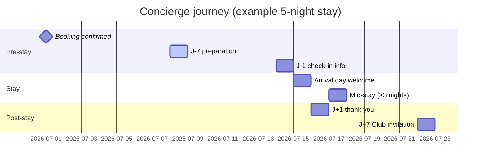

# WhatsApp concierge journey — v2 journey map (J-7 → J+7)

> Phase **8bis** — proactive accompaniment for every guest who booked on the site
> and opted in at checkout. Distinct from the Prestige **24/7 human** perk
> (`whatsapp_concierge_24_7`, ADR-0019 D4).

## Principles

| Rule                         | Implementation                                                      |
| ---------------------------- | ------------------------------------------------------------------- |
| Opt-in required              | Unchecked checkbox at booking; stored with timestamp + booking ref  |
| Opt-out instant              | `STOP` / `stop` / `arrêt` → flag + confirmation, then silence       |
| One channel per touchpoint   | Orchestrator picks WhatsApp **or** email, never both                |
| Templates outside 24h window | All proactive sends are pre-approved HSM (utility/marketing)        |
| Max 1 proactive msg / day    | Protect Meta quality rating                                         |
| ≤ 6 touchpoints per stay     | Journey cap per booking                                             |
| Grounded content             | Hotel fiche data (`concierge_advice`, F&B, POI) — no invented facts |
| PII never logged             | Phone hashed in observability; RLS on conversation tables           |

## Journey timeline



## Touchpoints

| Trigger           | Offset                      | Template (FR)               | Template (EN)               | Category  | Channel priority               |
| ----------------- | --------------------------- | --------------------------- | --------------------------- | --------- | ------------------------------ |
| Booking confirmed | T+0                         | `mch_journey_welcome_fr`    | `mch_journey_welcome_en`    | utility   | WhatsApp if opt-in, else email |
| Pre-arrival prep  | J-7                         | `mch_journey_prep_j7_fr`    | `mch_journey_prep_j7_en`    | utility   | ↑                              |
| Check-in briefing | J-1                         | `mch_journey_checkin_j1_fr` | `mch_journey_checkin_j1_en` | utility   | ↑                              |
| Arrival day       | Check-in date               | `mch_journey_arrival_fr`    | `mch_journey_arrival_en`    | utility   | ↑                              |
| Mid-stay check    | Night 2+ (stays ≥ 3 nights) | `mch_journey_midstay_fr`    | `mch_journey_midstay_en`    | utility   | ↑                              |
| Post-stay thanks  | J+1                         | `mch_journey_thanks_j1_fr`  | `mch_journey_thanks_j1_en`  | utility   | ↑                              |
| Club upsell       | J+7                         | `mch_journey_club_j7_fr`    | `mch_journey_club_j7_en`    | marketing | ↑ (separate marketing consent) |

Template IDs and placeholder keys live in
`apps/web-v2/src/server/whatsapp/templates.ts`.

## Inbound (guest → concierge)

Within the **24h customer-service window**, free-form replies are allowed
(LLM-grounded on domain data). Outside the window, only template replies.

| Inbound                                  | Handler                                                 | Domain                                                  |
| ---------------------------------------- | ------------------------------------------------------- | ------------------------------------------------------- |
| `STOP` / opt-out                         | Immediate flag + confirmation template                  | `consent` + orchestrator                                |
| Service request (restaurant, transfert…) | State machine `requested → relayed → confirmed/refused` | `packages/domain/src/whatsapp/service-request-state.ts` |
| General question                         | LLM agent grounded on `getHotelBySlug` + FAQ            | Future worker                                           |
| Prestige member                          | Escalate to human SLA                                   | ADR-0019 D4                                             |

Webhook entry: `POST /api/webhooks/whatsapp` (signed, fast-ack).

## Service-request state machine

```
requested ──► relayed ──► confirmed
                    └──► refused
```

Ops desk marks relay after forwarding to the hotel; hotel response closes the
request as confirmed or refused. Terminal states are immutable.

## Orchestration

`apps/web-v2/src/server/whatsapp/orchestrator.ts`:

1. `planJourneyDispatch(prefs, event)` — channel selection
2. `classifyInboundWhatsApp(...)` — webhook classification
3. `journeySendIdempotencyKey(bookingRef, touchpoint)` — Redis dedup

Email sibling templates: `emailTemplateSlugForTouchpoint()`.

## Data model (future migrations)

| Table                       | Purpose                                         |
| --------------------------- | ----------------------------------------------- |
| `whatsapp_journey_steps`    | Scheduled sends (`send_after`, idempotency key) |
| `whatsapp_conversations`    | Thread per booking ref                          |
| `whatsapp_messages`         | Inbound/outbound log (RLS service-role)         |
| `whatsapp_service_requests` | Service-request state + audit                   |

See `packages/db/migrations/0079_v2_schema_read_models.sql` for channel enum.

## References

- `.cursor/skills/whatsapp-concierge-journey/SKILL.md`
- ADR-0019 — Concierge Club / Prestige boundary
- `packages/integrations/src/whatsapp/types.ts` — webhook Zod schemas
